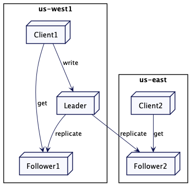
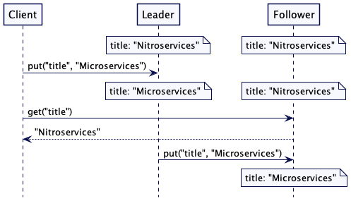
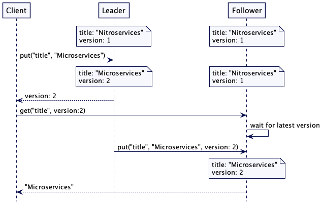

# Follower Reads

[TOC]


处理来自追随者的读取请求，以实现更好的吞吐量和更低的延迟

## 问题

使用 [Leader and Followers](https://martinfowler.com/articles/patterns-of-distributed-systems/leader-follower.html) 模式时，it's possible that the leader may get overloaded if too many requests are sent to it。此外，在客户端位于远程数据中心的多数据中心设置中，对领导者的请求将受到额外延迟的影响。

## 解决方案

虽然写入请求需要发送到领导者以保持一致性，但只读请求可以转而发送到最近的跟随者。 当客户端大多是只读的时，这特别有用。

重要的是要注意，从追随者那里读取的客户可以获得旧值。 领导者和追随者之间总会存在复制滞后，即使在像 Raft 这样实现共识算法的系统中也是如此。 这是因为即使领导者知道提交了哪些值，它也需要另一条消息将其传达给追随者。 因此，从跟随服务器读取仅在允许稍旧值的情况下使用。



Figure 1: Reading from the nearest follower

### 寻找最近的副本

集群节点维护有关其位置的其他元数据。

*class ReplicaDescriptor…*

```java
  public class ReplicaDescriptor {
      public ReplicaDescriptor(InetAddressAndPort address, String region) {
          this.address = address;
          this.region = region;
      }
      InetAddressAndPort address;
      String region;
  
      public InetAddressAndPort getAddress() {
          return address;
      }
  
      public String getRegion() {
          return region;
      }
  }
```

然后，集群客户端可以根据自己的区域获取本地副本。

*class ClusterClient…*

```java
 public List<String> get(String key) {
      List<ReplicaDescriptor> allReplicas = allFollowerReplicas(key);
      ReplicaDescriptor nearestFollower = findNearestFollowerBasedOnLocality(allReplicas, clientRegion);
      GetValueResponse getValueResponse = sendGetRequest(nearestFollower.getAddress(), new GetValueRequest(key));
      return getValueResponse.getValue();
  }

  ReplicaDescriptor findNearestFollowerBasedOnLocality(List<ReplicaDescriptor> followers, String clientRegion) {
      List<ReplicaDescriptor> sameRegionFollowers = matchLocality(followers, clientRegion);
      List<ReplicaDescriptor> finalList = sameRegionFollowers.isEmpty()?followers:sameRegionFollowers;
      return finalList.get(0);
  }

  private List<ReplicaDescriptor> matchLocality(List<ReplicaDescriptor> followers, String clientRegion) {
      return followers.stream().filter(rd -> clientRegion.equals(rd.region)).collect(Collectors.toList());
  }
```

​	例如，如果有两个追随者副本，一个在区域 us-west 中，另一个在区域 us-east 中。 来自 us-east 区域的客户端将连接到 us-east 副本。

```java
class CausalKVStoreTest…

  @Test
  public void getFollowersInSameRegion() {
      List<ReplicaDescriptor> followers = createReplicas("us-west", "us-east");
      ReplicaDescriptor nearestFollower = new ClusterClient(followers, "us-east").findNearestFollower(followers);
      assertEquals(nearestFollower.getRegion(), "us-east");

  }
```

​		集群客户端或协调集群节点也可以跟踪集群节点观察到的延迟。 它可以发送周期心跳来捕获延迟，并使用它以最小的延迟拾取跟随者。 为了进行更公平的选择，[MongoDB](https://www.mongodb.com/)或 [CockroachDB](https://www.cockroachlabs.com/docs/stable/)等产品将延迟计算为移动平均值[moving average](https://en.wikipedia.org/wiki/Moving_average)。 集群节点通常维护一个单套接字通道来与其他集群节点通信。 [Single Socket Channel](https://martinfowler.com/articles/patterns-of-distributed-systems/single-socket-channel.html)  需要一个 [HeartBeat]() 来保持连接处于活动状态。 因此，可以轻松实现捕获延迟和计算移动平均值。

```java
class WeightedAverage…

  public class WeightedAverage {
      long averageLatencyMs = 0;
      public void update(long heartbeatRequestLatency) {
          //Example implementation of weighted average as used in Mongodb
          //The running, weighted average round trip time for heartbeat messages to the target node.
          // Weighted 80% to the old round trip time, and 20% to the new round trip time.
          averageLatencyMs = averageLatencyMs == 0
                  ? heartbeatRequestLatency
                  : (averageLatencyMs * 4 + heartbeatRequestLatency) / 5;
      }
  
      public long getAverageLatency() {
          return averageLatencyMs;
      }
  }
```

```java
class ClusterClient…

  private Map<InetAddressAndPort, WeightedAverage> latencyMap = new HashMap<>();
  //
  private void sendHeartbeat(InetAddressAndPort clusterNodeAddress) {
      try {
          //单调时钟
          long startTimeNanos = System.nanoTime();
          sendHeartbeatRequest(clusterNodeAddress);
          //单调时钟
          long endTimeNanos = System.nanoTime();
		
          WeightedAverage heartbeatStats = latencyMap.get(clusterNodeAddress);
          if (heartbeatStats == null) {
              heartbeatStats = new WeightedAverage();
              latencyMap.put(clusterNodeAddress, new WeightedAverage());
          }
          heartbeatStats.update(endTimeNanos - startTimeNanos);

      } catch (NetworkException e) {
          logger.error(e);
      }
  }
```

```java
class ClusterClient…

  ReplicaDescriptor findNearestFollower(List<ReplicaDescriptor> allFollowers) {
      List<ReplicaDescriptor> sameRegionFollowers = matchLocality(allFollowers, clientRegion);
      List<ReplicaDescriptor> finalList
              = sameRegionFollowers.isEmpty() ? allFollowers
                                                :sameRegionFollowers;
      return finalList.stream().sorted((r1, r2) -> {
          if (!latenciesAvailableFor(r1, r2)) {
              return 0;
          }
          return Long.compare(latencyMap.get(r1).getAverageLatency(),
                              latencyMap.get(r2).getAverageLatency());

      }).findFirst().get();
  }

  private boolean latenciesAvailableFor(ReplicaDescriptor r1, ReplicaDescriptor r2) {
      return latencyMap.containsKey(r1) && latencyMap.containsKey(r2);
  }
```


### 断开链接或是缓慢的 Followers


​		追随者可能会与领导者断开连接并停止获取更新。 在某些情况下，follower 可能会遇到阻碍整个复制过程的慢速磁盘，这会导致 follower 落后于 leader。 追随者可以跟踪它是否有一段时间没有收到领导者的消息，并停止服务用户请求。

​		例如，像 MongoDB 这样的产品允许选择具有*最大允许延迟时间* [maximum allowed lag time](https://docs.mongodb.com/manual/core/read-preference-staleness/#std-label-replica-set-read-preference-max-staleness)的副本。 如果副本落后于领导者超过此最大时间，则不会选择它来服务请求。 在*Kafka*中，如果*follower*检测到消费者请求的偏移量太大，它会以*OFFSET_OUT_OF_RANGE*错误响应。 然后期望消费者与领导者进行通信。

### 读己之写

​		从跟随服务器读取可能会出现问题，因为在客户端写入某些内容然后立即尝试读取它的常见场景中，它可能会产生令人惊讶的结果。

​		考虑一个客户，他注意到某些图书数据错误地具有“标题”：“Nitroservices”。 它通过写入“title”：“microservice”来纠正这一点，该标题将发送给领导者。 然后它会立即读回该值，但读取请求会发送给可能尚未更新的追随者。



​		这可能是一个常见问题。例如，直到最近 Amazon S3 才解决掉这一点 [untill very recently](https://aws.amazon.com/about-aws/whats-new/2020/12/amazon-s3-now-delivers-strong-read-after-write-consistency-automatically-for-all-applications/)。

​		为了解决这个问题，每次写入时，服务器不仅存储新值，还存储单调递增的版本标记。标记可以是高水位线或混合时钟。服务器在对写入请求的响应中返回存储值的版本标记。然后，如果客户端希望稍后读取该值，它会将版本标记作为其读取请求的一部分。如果读取请求发送给跟随者，它会检查其存储的值以查看它是否等于或晚于请求的版本标记。如果不是，它会等到有最新版本后再返回值。通过这样做，客户端将始终读取与他们写入的值一致的值——这通常被称为读己之写**read-your-writes consistency**的一致性。

​	请求流程如下所示： 为了纠正错误写入的值，“title”：“Microservices”被写入领导者。领导者在响应中向客户端返回版本 2。当客户端尝试读取“title”的值时，它会在请求中传递版本号 2。接收请求的跟随服务器检查自己的版本号是否是最新的。因为从服务器上的版本号仍然是 1，所以它一直等到它从领导者那里得到那个版本。一旦它拥有匹配的（或更高版本）版本，它就会完成读取请求，并返回值“Microservices”。




```asciiarmor
因果一致性
当系统中的一个事件 A 在另一个事件 B 之前发生时，就说它具有因果关系。 这种因果关系意味着 A 可能在导致 B 方面发挥了某种作用。

对于数据存储系统，事件是关于写入和读取值的。 为了提供因果一致性，存储系统需要跟踪读写事件之间的happens-before关系。 Lamport Clock 及其变体用于此目的。
```

​		键值存储的代码如下所示。 需要注意的是，跟随者可能落后太多或与领导者断开连接。 所以它不会无限期地等待。 有一个配置的超时值。 如果follower服务器在超时时间内无法获取更新，则会向客户端返回错误响应。 然后，客户端可以重试从其他follower那里读取。

```java
class ReplicatedKVStore…

  Map<Integer, CompletableFuture> waitingRequests = new ConcurrentHashMap<>();
  public CompletableFuture<Optional<String>> get(String key, int atVersion) {
      if(this.server.getRole() == ServerRole.FOLLOWING) {
          //check if we have the version with us;
          if (!isVersionUptoDate(atVersion)) {
              //wait till we get the latest version.
              CompletableFuture<Optional<String>> future = new CompletableFuture<>();
              //Timeout if version does not progress to required version
              //before followerWaitTimeout ms.
              future.orTimeout(config.getFollowerWaitTimeoutMs(), TimeUnit.MILLISECONDS);
              waitingRequests.put(atVersion, future);
              return future;
          }
      }
      return CompletableFuture.completedFuture(mvccStore.get(key, atVersion));
  }

  private boolean isVersionUptoDate(int atVersion) {
      Optional<Long> maxVersion = mvccStore.getMaxVersion();
      return maxVersion.map(v -> v >= atVersion).orElse(false);
  }
```

一旦键值存储升级到客户端请求的版本，它就可以将响应发送给客户端。

```java
class ReplicatedKVStore…

  private Response applyWalEntry(WALEntry walEntry) {
      Command command = deserialize(walEntry);
      if (command instanceof SetValueCommand) {
          return applySetValueCommandsAndCompleteClientRequests((SetValueCommand) command);
      }
      throw new IllegalArgumentException("Unknown command type " + command);
  }

  private Response applySetValueCommandsAndCompleteClientRequests(SetValueCommand setValueCommand) {
      getLogger().info("Setting key value " + setValueCommand);
      version = version + 1;
      mvccStore.put(new VersionedKey(setValueCommand.getKey(), version), setValueCommand.getValue());
      completeWaitingFuturesIfFollower(version, setValueCommand.getValue());
      Response response = Response.success(version);
      return response;
  }

  private void completeWaitingFuturesIfFollower(int version, String value) {
      CompletableFuture completableFuture = waitingRequests.remove(version);
      if (completableFuture != null) {
          completableFuture.complete(Optional.of(value));
      }
  }
```


### 线性化读取

​		有时读取请求需要获取最新的可用数据。 不能容忍复制滞后。 在这些情况下，需要将读取请求重定向到领导者。 这是 [Consistent Core](Consistent Core.md) 解决的常见设计问题；

## 例子

[[neo4j\]](https://neo4j.com/docs/operations-manual/current/clustering/) 允许设置因果集群[causal clusters](https://neo4j.com/docs/operations-manual/current/clustering-advanced/lifecycle/#causal-clustering-lifecycle)。每个写入操作都会返回一个书签，可以在对只读副本执行查询时传递该书签。书签确保客户端将始终获得写入书签的值；

[MongoDB](https://www.mongodb.com/) 在其副本集中维护因果一致性。写操作返回一个操作时间；这在随后的读取请求中传递，以确保读取请求返回读取请求之前发生的写入。

[CockroachDB](https://www.cockroachlabs.com/docs/stable/)  允许客户端从跟随服务器读取。领导者服务器发布在领导者上完成写入的最新时间戳，称为关闭时间戳。如果跟随者在关闭的时间戳处具有值，则允许读取这些值。

Kafka 允许使用来自追随者代理的消息。追随者知道领导者的高水位标记。在 *kafka* 的设计中，broker 不是等待最新的更新，而是向消费者返回一个 *OFFSET_NOT_AVAILABLE* 错误，并期望消费者重试。
