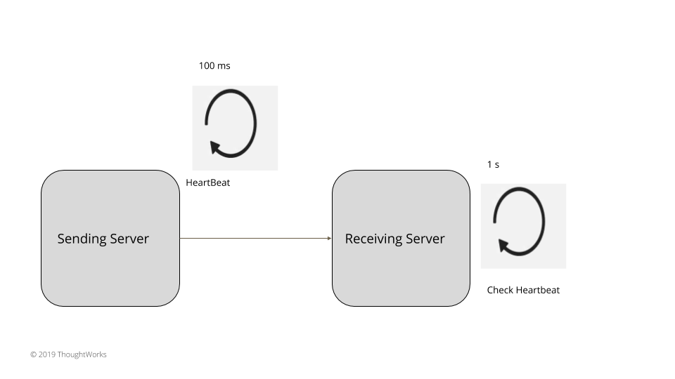

# HeartBeat

通过定期向所有其他服务器发送消息来显示服务器可用。


[TOC]


## 问题

当多个服务器组成一个集群时，这些服务器负责根据所使用的分区和复制方案存储部分数据。 及时检测服务器故障对于确保可以通过让其他一些服务器负责处理故障服务器上的数据请求来采取纠正措施非常重要。


## 解决方案



​		定期向所有其他服务器发送请求，指示发送服务器的活跃性。 选择请求间隔大于服务器之间的网络往返时间。 所有服务器都等待超时间隔，该间隔是检查心跳的请求间隔的倍数。 一般来说，超时间隔>请求间隔>服务器之间的网络往返时间。

```asciiarmor
在决定心跳间隔和超时值时，了解数据中心内和数据中心之间的网络往返时间很有用。
[numbers-every-programmer-should-know 是一个很好的参考。http://highscalability.com/numbers-everyone-should-know
```

​		例如 如果服务器之间的网络往返时间为 20 毫秒，则可以每 100 毫秒发送一次心跳，服务器会在 1 秒后检查，以便有足够的时间发送多个心跳，而不会出现误报。 如果在此时间间隔内没有收到心跳，则声明发送服务器失败。

​		两个服务器，一个发送心跳和一个接收心跳，都有一个如下定义的调度器。 调度程序被赋予一个定期执行的方法。 启动时，任务被安排执行给定的方法。

class HeartBeatScheduler…

```java
  public class HeartBeatScheduler implements Logging {
      private ScheduledThreadPoolExecutor executor = new ScheduledThreadPoolExecutor(1);
  
      private Runnable action;
      private Long heartBeatInterval;
      public HeartBeatScheduler(Runnable action, Long heartBeatIntervalMs) {
          this.action = action;
          this.heartBeatInterval = heartBeatIntervalMs;
      }
  
      private ScheduledFuture<?> scheduledTask;
      public void start() {
          scheduledTask = executor.scheduleWithFixedDelay(new HeartBeatTask(action), heartBeatInterval, heartBeatInterval, TimeUnit.MILLISECONDS);
      }
```

在发送服务器端，调度程序执行一个发送心跳消息的方法。

class SendingServer…

```java
  private void sendHeartbeat() throws IOException {
      socketChannel.blockingSend(newHeartbeatRequest(serverId));
  }
```

在接收服务器上，故障检测机制启动了类似的调度程序。 它会定期检查是否收到了心跳。

class AbstractFailureDetector…

```java
  private HeartBeatScheduler heartbeatScheduler = new HeartBeatScheduler(this::heartBeatCheck, 100l);

  abstract void heartBeatCheck();
  abstract void heartBeatReceived(T serverId);
```

故障检测器需要有两种方法：

* 接收服务器接收到心跳时调用的方法，告诉故障检测器接收到心跳
  - class ReceivingServer…

  - ```java
      private void handleRequest(Message<RequestOrResponse> request) {
          RequestOrResponse clientRequest = request.getRequest();
          if (isHeartbeatRequest(clientRequest)) {
              HeartbeatRequest heartbeatRequest = JsonSerDes.deserialize(clientRequest.getMessageBodyJson(), HeartbeatRequest.class);
              failureDetector.heartBeatReceived(heartbeatRequest.getServerId());
              sendResponse(request);
          } else {
              //processes other requests
          }
      }
    ```

* 一种定期检查心跳状态并检测可能的故障的方法。

​		何时将服务器标记为失败的实现取决于各种标准。 有不同的权衡。 一般来说，心跳间隔越小，检测到故障的速度越快，但错误检测到故障的概率越高。 所以心跳间隔和丢失心跳的解释是根据集群的要求来实现的。 一般有以下两大类。


### 小集群 - 例如 RAFT、Zookeeper 等基于共识的系统

​		在所有共识实现中，Heartbeats 从领导服务器发送到所有追随者服务器。 每次收到心跳，记录心跳到达的时间戳

***class TimeoutBasedFailureDetector…***

```java
  @Override
  void heartBeatReceived(T serverId) {
      Long currentTime = System.nanoTime();
      heartbeatReceivedTimes.put(serverId, currentTime);
      markUp(serverId);
  }
```

​		如果在固定的时间窗口内没有收到心跳，则认为leader崩溃，并选举新的服务器作为leader。 由于缓慢的进程或网络，可能会出现错误的故障检测。 所以需要使用Generation Clock来检测过时的leader。 这提供了更好的系统可用性，因为在更短的时间段内检测到崩溃。 这适用于较小的集群，通常是 3 到 5 个节点设置，这在 Zookeeper 或 Raft 等大多数共识实现中都可以观察到。

***class TimeoutBasedFailureDetector…***

```java
  @Override
  void heartBeatCheck() {
      Long now = System.nanoTime();
      Set<T> serverIds = heartbeatReceivedTimes.keySet();
      for (T serverId : serverIds) {
          Long lastHeartbeatReceivedTime = heartbeatReceivedTimes.get(serverId);
          Long timeSinceLastHeartbeat = now - lastHeartbeatReceivedTime;
          if (timeSinceLastHeartbeat >= timeoutNanos) {
              markDown(serverId);
          }
      }
  }
```


### 技术考虑

​		当使用 Single Socket Channel 在服务器之间进行通信时，必须注意确保 [head-of-line-blocking]队头阻塞 不会阻止处理心跳消息。否则，它可能会导致足够长的延迟，从而错误地检测到发送服务器已关闭，即使发送服务器定期发送心跳也是如此。请求管道可用于确保服务器在发送心跳之前不等待先前请求的响应。有时，在使用 Singular Update Queue 时，某些任务（如磁盘写入）可能会导致延迟，这可能会延迟计时中断的处理并延迟发送心跳。

​		这可以通过使用单独的线程异步发送心跳来解决。 [*consul*] 和 [*akka*] 等框架异步发送心跳。这也可能是接收服务器的问题。做磁盘写的接收服务器，只有在写完成后才能检查心跳，导致错误的故障检测。因此使用单一更新队列的接收服务器可以重置其心跳检查机制以合并这些延迟。 *Raft* 的参考实现，[*log-cabin*] 就是这样做的。

​		有时，由于某些特定于运行时的事件（如垃圾收集）而导致的 [*local-pause*] 可能会延迟心跳的处理。需要有一种机制来检查处理是否在可能的本地暂停之后发生。一个简单的机制是检查处理是否在足够长的时间窗口后发生，例如5秒。在这种情况下，不会根据时间窗口将任何内容标记为失败，并将其推迟到下一个周期。 [*Cassandra* 中的实现](https://issues.apache.org/jira/browse/CASSANDRA-9183)就是一个很好的例子。


## 大型集群 - 基于Gossip的协议

​		上一节中描述的心跳不能扩展到具有数百到数千台服务器跨越广域网的更大集群。在大型集群中，需要考虑两件事：

* 固定每台服务器生成的消息数量限制;
* 心跳消息消耗的总带宽。它不应该消耗大量的网络带宽。应该有几百千字节的上限，以确保过多的心跳消息不会影响跨集群的实际数据传输;


​	    由于这些原因，避免了所有对所有的心跳。在这些情况下，通常使用故障检测器以及用于在集群中传播故障信息的 Gossip 协议。这些集群通常会采取行动，例如在发生故障时跨节点移动数据，因此更喜欢正确的检测并容忍更多的延迟（尽管有界）。主要挑战是不要因为网络延迟或进程缓慢而错误地将节点检测为故障。然后使用的一种常见机制是为每个进程分配一个怀疑编号，如果在有限时间内没有包括该进程的Gossip，则该编号递增。它是根据过去的统计数据计算出来的，只有在这个怀疑数达到配置的上限后，才会被标记为失败。

​	有两种主流实现：

* Phi Accrual 故障检测器（用于 Akka、Cassandra）
* 带有 Lifeguard 增强功能的 SWIM（用于 Hashicorp Consul，成员列表）这些实现在具有数千台机器的广域网上扩展。众所周知，Akka 可用于 2400 台服务器。 Hashicorp Consul 通常会在一个组中部署数千个 consul 服务器。

​	   拥有一个可靠的故障检测器，它可以有效地用于大型集群部署，同时提供一些一致性保证，仍然是一个积极开发的领域。 [Rapid](https://www.usenix.org/conference/atc18/presentation/suresh) 等框架的一些最新发展看起来很有希望。


## 例子

* ZAB 或 RAFT 等共识实现与小型三到五个节点集群一起工作，实现了基于固定时间窗口的故障检测。
* Akka Actors 和 Cassandra 使用 Phi Accrual 故障检测器。
* Hashicorp consul 使用基于 gossip 的故障检测器 SWIM。