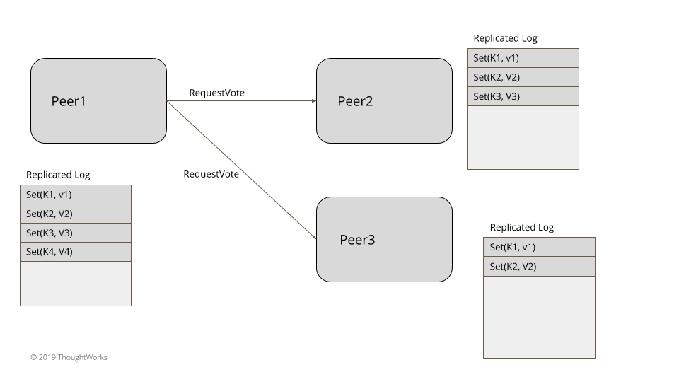
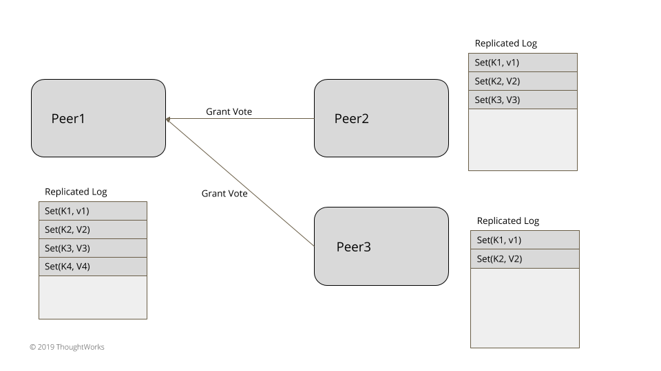
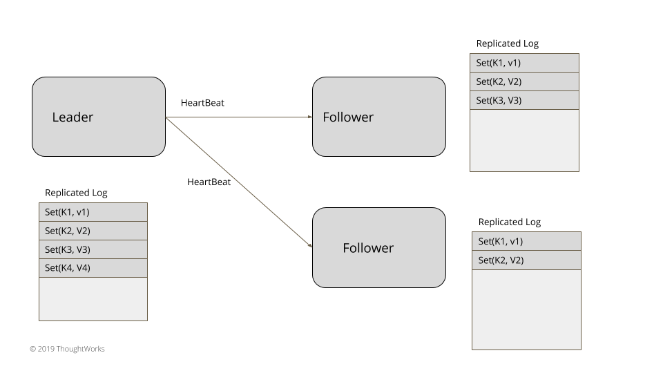
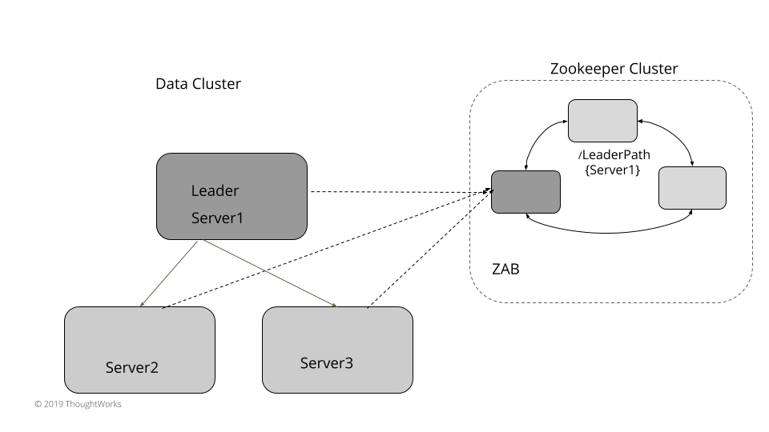

# Leader and Followers

有一个服务器来协调跨一组服务器的复制。

[TOC]

## 问题

​		为了在管理数据的系统中实现容错，需要在多个服务器上复制数据。

​		为客户提供一致性保证非常重要。 当数据在多个服务器上更新时，需要决定何时将其对客户端可见。 写入和读取 Quorum 是不够的，因为某些故障场景可能会导致客户端查看数据不一致。 每个单独的服务器不知道[Quorum]()中其他服务器上的数据状态，只有从多个服务器读取数据时，才能解决不一致的问题。 在某些情况下，这还不够。 发送给客户端的数据需要更强有力的保证。


## 解决方案

​		在集群中选择一台服务器作为领导者。 领导者负责代表整个集群做出决策，并将决策传播到所有其他服务器。

​		每台服务器在启动时都会寻找现有的领导者。 如果没有找到leader，就会触发leader选举。 服务器仅在成功选择领导者后才接受请求。 只有领导者处理客户端请求。 如果一个请求被发送到一个追随者服务器，追随者可以将它转发给领导者服务器。


### 领导选举



Figure 1: Election






​		对于三到五个节点的小型集群，例如在实现共识的系统中，领导者选举可以在数据集群本身内实现，而不依赖于任何外部系统。 领导者选举发生在服务器启动时。 每台服务器在启动时都会开始选举领导者，并尝试选举领导者。 除非选出领导者，否则系统不接受任何客户端请求。 正如 Generation Clock 模式中所解释的，每次领导人选举也需要更新世代号。 服务器可以始终处于三种状态之一，Leader、Follower 或正在寻找 Leader（或 Candidate）

```java
public enum ServerRole {
    LOOKING_FOR_LEADER,
    FOLLOWING,
    LEADING;
}
```

​		HeartBeat 机制用于检测现有的leader是否失败，从而可以开始新的leader选举。通过向每个对等服务器发送请求投票的消息来开始新的领导者选举。

​		通过向每个对等服务器发送请求投票的消息来开始新的领导者选举。


## 选举算法

选举领导者时要考虑两个因素。

* 因为这些系统最常用于数据复制，需要一些额外的限制：那些服务器能够赢得选举 -- 只有“最新”的服务器才能成为合法的领导者。例如，在典型的基于共识的系统中，“最新”由两件事定义：
  * 最新一代时钟
  * Write-Ahead Log 中的最新日志索引

* 如果所有服务器都是最新的，则根据以下标准选择领导者：
  * 一些实现特定的标准，例如哪个服务器排名更好或具有更高的 id。 （例如Zab）
  * 如果注意确保一次只有一个服务器要求投票，那么无论哪个服务器在其他服务器之前开始选举。 （例如Raft）

一旦在给定的 Generation Clock 中对服务器进行了投票，则始终为该代返回相同的投票。 这可以确保在成功的选举已经发生时，不会选举其他请求对同一代进行投票的服务器。 投票请求的处理如下：

class ReplicatedLog…

```java
  VoteResponse handleVoteRequest(VoteRequest voteRequest) {
      //for higher generation request become follower.
      // But we do not know who the leader is yet.
      if (voteRequest.getGeneration() > replicationState.getGeneration()) {
          becomeFollower(LEADER_NOT_KNOWN, voteRequest.getGeneration());
      }

      VoteTracker voteTracker = replicationState.getVoteTracker();
      if (voteRequest.getGeneration() == replicationState.getGeneration() && !replicationState.hasLeader())  	   {
              if(isUptoDate(voteRequest) && !voteTracker.alreadyVoted()) {
                  voteTracker.registerVote(voteRequest.getServerId());
                  return grantVote();
              }
              if (voteTracker.alreadyVoted()) {
                  return voteTracker.votedFor == voteRequest.getServerId() ?
                          grantVote():rejectVote();

              }
      }
      return rejectVote();
  }
  
  private boolean isUptoDate(VoteRequest voteRequest) {
      boolean result = voteRequest.getLastLogEntryGeneration() > wal.getLastLogEntryGeneration()
              || (voteRequest.getLastLogEntryGeneration() == wal.getLastLogEntryGeneration() &&
              voteRequest.getLastLogEntryIndex() >= wal.getLastLogIndex());
      return result;
  }
```


### 使用外部 [[Linearizable\]](https://jepsen.io/consistency/models/linearizable) 存储的领导人选举

​	在数据集群中运行领导者选举适用于较小的集群。对于可能多达几千个节点的大型数据集群，使用 Zookeeper 或 etcd 等外部存储更容易。 （内部使用共识并提供线性化保证）。这些大型集群通常有一个标记为主节点或控制器节点的服务器，它代表整个集群做出所有决策。实现领导人选举需要三个功能：

* compareAndSwap 指令以原子方式设置密钥。
* 一种心跳机制，可以在没有收到Leader的心跳时过期密钥（Key），以便触发新的选举。
* 一种通知机制，用于在密钥过期时通知所有感兴趣的服务器。


​	为了选举领导者，每个服务器使用 compareAndSwap 指令尝试在外部存储中创建一个密钥，并且无论哪个服务器首先成功，都将被选为领导者。根据使用的外部存储，密钥的创建时间很短、领导者在Key过期之前不断的更新密钥.每个服务器都可以对此密钥设置监视（Watch），如果密钥过期而没有在生存时间设置内从现有领导者那里更新，服务器会收到通知。例如etcd 允许 compareAndSwap 操作，仅当 key 以前不存在时才允许 set key 操作。在 Zookeeper 中，不支持显式的 compareAndSwap 类型的操作，但可以通过尝试创建节点来实现，如果节点已经存在则期待异常。也没有明确的生存时间，但是 zookeeper 有一个临时节点的概念。该节点一直存在，直到服务器与 zookeeper 建立活动会话，否则该节点将被删除并通知正在监视该节点的每个人。例如，Zookeeper 可用于选举领导者，如下所示：

class ServerImpl…

```java
  public void startup() {
      zookeeperClient.subscribeLeaderChangeListener(this);
      elect();
  }

  public void elect() {
      var leaderId = serverId;
      try {
          zookeeperClient.tryCreatingLeaderPath(leaderId);
          this.currentLeader = serverId;
          onBecomingLeader();
      } catch (ZkNodeExistsException e) {
          //back off
          this.currentLeader = zookeeperClient.getLeaderId();
      }
  }
```

​	所有其他服务器都监视现有领导者的活跃度。 当检测到现有leader宕机时，触发新的leader选举。 故障检测使用用于领导选举的相同外部线性化存储进行。 该外部存储还具有实现组成员资格和故障检测机制的设施。 例如，扩展上述基于 Zookeeper 的实现，可以使用 Zookeeper 配置更改侦听器，当现有领导节点发生更改时触发该更改侦听器。

class ZookeeperClient…

```java
  public void subscribeLeaderChangeListener(IZkDataListener listener) {
      zkClient.subscribeDataChanges(LeaderPath, listener);
  }
```

集群中的每台服务器都订阅此更改，并且每当触发回调时，都会再次触发新的选举，如上所示。

class ServerImpl…

```java
  @Override
  public void handleDataDeleted(String dataPath) throws Exception {
      elect();
  }
```



像 etcd 或 Consul 这样的系统可以使用相同的方式来实现领导者选举。

### 为什么 Quorum 读/写不足以保证强一致性

​		它可能看起来像 <u>*Cassandra*</u> 等 <u>*Dynamo*</u> 风格数据库提供的 *Quorum* 读/写，足以在服务器故障的情况下获得强一致性。但事实并非如此。考虑以下示例。假设我们有一个包含三台服务器的集群。变量 x 存储在所有三个服务器上。 （它的复制因子为 3）。启动时 x = 1 的值。

* 假设 writer1 写入 x = 2，复制因子为 3。写入请求被发送到所有三个服务器。 server1 上的写入成功，但 server2 和 server3 上的写入失败。 （网络故障或 writer1 在将写入请求发送到 server1 后刚刚进入长时间的垃圾收集暂停。）。
* 客户端 c1 从 server1 和 server2 读取 x 的值。它获取 x=2 的最新值，因为 server1 具有最新值。
* 客户端 c2 触发对 x 的读取。但是 Server1 暂时停机。因此 c1 从 server2、server3 读取它，它们的 x 为旧值，x=1。因此，即使在 c1 读取最新值之后读取它，c2 也会获取旧值。

​		这样，两次连续读取显示最新值消失。一旦 server1 恢复，后续读取将提供最新值。并且假设读取修复或反熵进程正在运行，其余服务器也将“最终”获得最新值。但是存储集群并不能保证一旦某个特定值对任何客户端可见，即使服务器出现故障，所有后续读取都将继续获得该值。


## 例子

* 对于实现共识的系统，重要的是只有一台服务器协调复制过程的活动。 正如论文 Paxos Made Simple 中所指出的，它对系统的活跃性很重要。
* 在 Raft 和 Zab 共识算法中，领导者选举是一个显式阶段，发生在启动或领导者失败时。
* [viewstamped replication](http://pmg.csail.mit.edu/papers/vr-revisited.pdf) 复制算法有Primary的概念，类似于其他算法中的leader。
* Kafka 有一个控制器，它负责代表集群的其余部分做出所有决定。 它对来自 Zookeeper 的事件做出反应，对于 Kafka 中的每个分区，都有一个指定的领导者代理和追随者代理。 领导者和追随者的选择由控制器代理完成。

