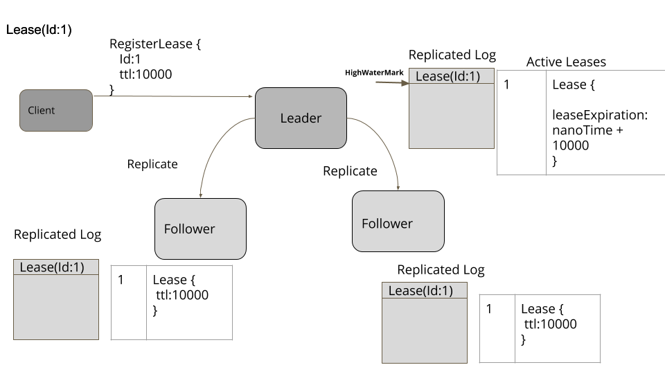
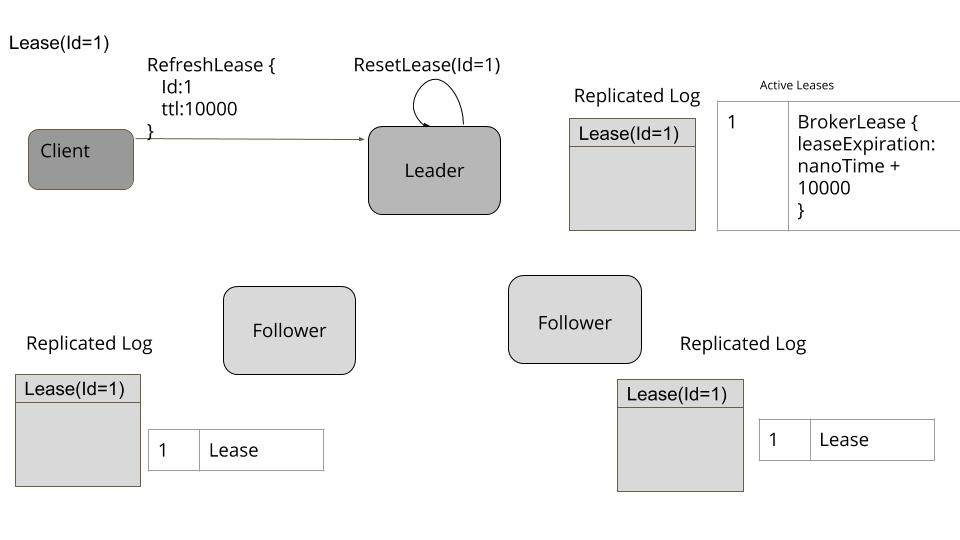
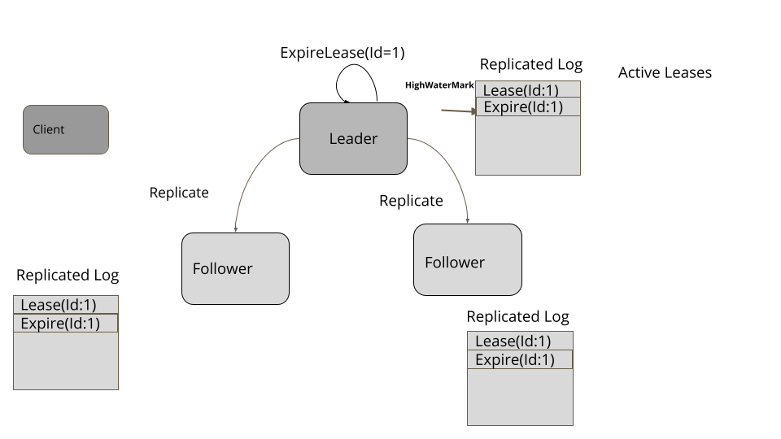
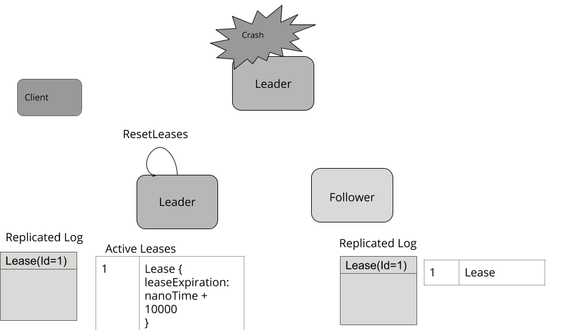
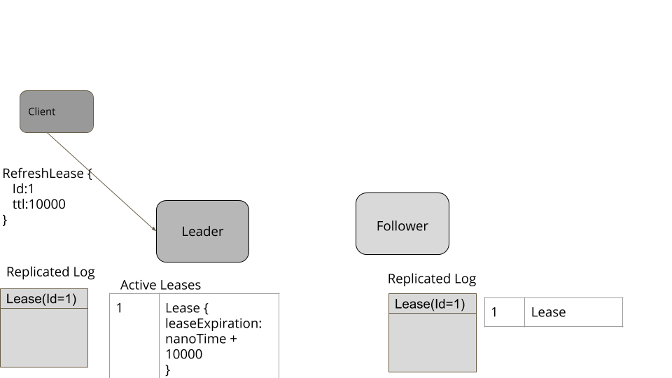

# Lease

使用集群节点的时间限制的租约来协调它们的活动。

[TOC]


## 问题

​		集群节点需要独占访问某些资源。 但是节点可能会崩溃； 它们可能会暂时断开连接或经历进程暂停。 在这些错误情况下，他们不应无限期地保持对资源的访问。

​		

## 解决方案

​		集群节点可以在有限的时间段内申请租约，然后到期。如果节点想要扩展访问，它可以在租约到期之前更新租约。使用 [Consistent Core](./Consistent Core.md) 实施租用机制以提供容错和一致性。具有与租约相关的“生存时间”价值。集群节点可以在带有租约的一致核心中创建密钥。使用Leader和Followers复制租约以提供容错。拥有租约的节点有责任定期刷新它。客户端使用 *<u>HeartBeat</u>* 来刷新[Consistent Core](./Consistent Core.md) 中的生存时间值。租约在 Consistent Core 中的所有节点上创建，但只有领导者跟踪租约超时。 

​		[1] 一致性核心中的追随者不跟踪超时。这样做是因为我们需要领导者使用自己的单调时钟来决定租约何时到期，然后让追随者知道租约何时到期。这确保了与一致性核心中的任何其他决定一样，节点也可以就租约到期达成共识。

​		当来自一致核心的节点成为领导者时，它开始跟踪租约。

```asciiarmor
挂钟不是单调的
计算机有两种不同的机制来表示时间。挂钟时间，代表一天中的时间，由通常用晶体振荡器构建的时钟机械测量。这种机制的已知问题是它可能会偏离一天中的实际时间，这取决于晶体振荡的快慢。为了解决这个问题，计算机通常具有 NTP 设置之类的服务，该服务使用 Internet 上众所周知的时间源检查一天中的时间并修复本地时间。因此，给定服务器中挂钟时间的两次连续读数可以使时间倒退。这使得挂钟时间不适合测量某些事件之间经过的时间。计算机有一种不同的机制，称为单调时钟，它指示经过的时间。单调时钟的值不受 NTP 等服务的影响。保证连续两次调用单调时钟可以得到经过的时间。因此，为了测量超时值，总是使用单调时钟。这在单个服务器上运行良好。但是无法比较两个不同服务器上的单调时钟。所有编程语言都有一个 api 来读取挂钟和单调时钟。例如在 Java 中 System.currentMillis 给出挂钟时间，而 System.nanoTime 给出单调时钟时间。
```


*class ReplicatedKVStore…*

```java
  public void onBecomingLeader() {
      leaseTracker = new LeaderLeaseTracker(this, new SystemClock(), server);
      leaseTracker.start();
  }
```

领导者启动定时任务以定期检查租约到期

*class LeaderLeaseTracker…*

```java
  private ScheduledThreadPoolExecutor executor = new ScheduledThreadPoolExecutor(1);
  private ScheduledFuture<?> scheduledTask;
  @Override
  public void start() {
      scheduledTask = executor.scheduleWithFixedDelay(this::checkAndExpireLeases,
              leaseCheckingInterval,
              leaseCheckingInterval,
              TimeUnit.MILLISECONDS);

  }

  @Override
  public void checkAndExpireLeases() {
      remove(expiredLeases());
  }

  private void remove(Stream<String> expiredLeases) {
      expiredLeases.forEach((leaseId)->{
          //remove it from this server so that it doesnt cause trigger again.
          expireLease(leaseId);
          //submit a request so that followers know about expired leases
          submitExpireLeaseRequest(leaseId);
      });
  }

  private Stream<String> expiredLeases() {
      long now = System.nanoTime();
      Map<String, Lease> leases = kvStore.getLeases();
      return leases.keySet().stream()
              .filter(leaseId -> {
          Lease lease = leases.get(leaseId);
          return lease.getExpiresAt() < now;
      });
  }
```

追随者启动无操作租赁跟踪器。

class ReplicatedKVStore…

```java
  public void onCandidateOrFollower() {
      if (leaseTracker != null) {
          leaseTracker.stop();
      }
      leaseTracker = new FollowerLeaseTracker(this, leases);
  }
```

租约简单表示如下：

```java
public class Lease implements Logging {
    String name;
    long ttl;
    //Time at which this lease expires
    long expiresAt;

    //The keys from kv store attached with this lease
    List<String> attachedKeys = new ArrayList<>();

    public Lease(String name, long ttl, long now) {
        this.name = name;
        this.ttl = ttl;
        this.expiresAt = now + ttl;
    }

    public String getName() {
        return name;
    }

    public long getTtl() {
        return ttl;
    }

    public long getExpiresAt() {
        return expiresAt;
    }

    public void refresh(long now) {
        expiresAt = now + ttl;
        getLogger().info("Refreshing lease " + name + " Expiration time is " + expiresAt);
    }

    public void attachKey(String key) {
        attachedKeys.add(key);
    }

    public List<String> getAttachedKeys() {
        return attachedKeys;
    }
}
```

​		当一个节点想要创建一个租约时，它会与[Consistent Core](https://martinfowler.com/articles/patterns-of-distributed-systems/consistent-core.html)的leader连接并向其发送请求 创建租约。 注册Lease请求的复制和处理类似于 [Consistent Core](https://martinfowler.com/articles/patterns-of-distributed-systems/consistent-core.html) 中的其他请求。 只有当 [High-Water Mark](https://martinfowler.com/articles/patterns-of-distributed-systems/high-watermark.html) 在复制日志中达到请求条目的日志索引时，请求才完成 .

class ReplicatedKVStore…

```java
private ConcurrentHashMap<String, Lease> leases = new ConcurrentHashMap<>();
@Override
public CompletableFuture<Response> registerLease(String name, long ttl) {
    if (leaseExists(name)) {
        return CompletableFuture
                .completedFuture(
                        Response.error(Errors.DUPLICATE_LEASE_ERROR,
                            "Lease with name " + name + " already exists"));
    }
    return server.propose(new RegisterLeaseCommand(name, ttl));
}

private boolean leaseExists(String name) {
    return leases.containsKey(name);
}
```

​		需要注意的重要一点是在哪里验证重复的租赁注册。在提出请求之前检查它是不够的，因为可能有多个正在进行的请求。 因此，在复制成功后注册租约时，服务器也会检查重复项。

class LeaderLeaseTracker…

```java
  private Map<String, Lease> leases;
  @Override
  public void addLease(String name, long ttl) throws DuplicateLeaseException {
      if (leases.get(name) != null) {
          throw new DuplicateLeaseException(name);
      }
      Lease lease = new Lease(name, ttl, clock.nanoTime());
      leases.put(name, lease);
  }
```




*Figure 1: Register Lease*

​	负责租约的节点连接到领导者并在租约到期之前刷新租约。 正如 *HeartBeat* 中所讨论的，它需要考虑网络往返时间来决定“生存时间”值，并在租约到期之前发送刷新请求。 节点可以在“生存时间”时间间隔内多次发送刷新请求，以确保在出现任何问题时刷新租约。 但是节点还需要确保没有发送过多的刷新请求。 <u>**在大约一半的租用时间过去后发送请求是合理的**</u>。 这导致在租用时间内最多有两个刷新请求。 客户端节点使用自己的单调时钟跟踪时间。

```asciiarmor
像任何心跳机制一样，这里假设服务器的单调时钟不快于客户端的单调时钟。 为了处理任何可能的速率差异，客户端需要保守并在超时间隔内向服务器发送多个心跳。

例如，Zookeeper 默认会话超时时间为 10 秒，使用 1/3 的会话超时时间发送心跳。 Apache Kafka 在其新架构中使用 18 秒作为租约到期时间，每 3 秒发送一次心跳。
```


class LeaderLeaseTracker…

```java
  @Override
  public void refreshLease(String name) {
      Lease lease = leases.get(name);
      lease.refresh(clock.nanoTime());
  }
```

刷新请求只发送给 Consistent Core 的领导者，因为只有领导者负责决定租约何时到期。



​		当租约到期时，它会从领导者中移除。 将此信息提交给一致的核心也很重要。 所以领导者发送一个过期租约的请求，这个请求和 Consistent Core 中的其他请求一样处理。 一旦 High-Water Mark 达到提议的过期租约请求，它就会从所有追随者中删除。




### 将租约附加到键值存储中的键


​		集群需要知道它的一个节点是否发生故障。 它可以通过让节点从 Consistent Core 获取租约，然后将其附加到它存储在 Consistent Core 中的自识别密钥来做到这一点。 如果集群节点正在运行，它应该定期更新租约。 如果租约到期，则删除关联的密钥。 当密钥被删除时，一个指示节点故障的事件被发送到感兴趣的集群节点，如 State Watch 模式中所讨论的。

​		使用 Consistent Core 的集群节点通过网络调用创建租约，如下所示：

```java
consistentCoreClient.registerLease("server1Lease", TimeUnit.SECONDS.toNanos(5));
```

​		然后，它可以将此租约附加到它存储在一致核心中的自我识别密钥。

```java
consistentCoreClient.setValue("/servers/1", "{address:192.168.199.10, port:8000}", "server1Lease");
```

当 Consistent Core 接收到将密钥保存在其键值存储中的消息时，它还将密钥附加到指定的租约。


class ReplicatedKVStore…

```java
  private ConcurrentHashMap<String, Lease> leases = new ConcurrentHashMap<>();
```

class ReplicatedKVStore…

```java
  private Response applySetValueCommand(Long walEntryId, SetValueCommand setValueCommand) {
      getLogger().info("Setting key value " + setValueCommand);
      if (setValueCommand.hasLease()) {
          Lease lease = leases.get(setValueCommand.getAttachedLease());
          if (lease == null) {
              //The lease to attach is not available with the Consistent Core
              return Response.error(Errors.NO_LEASE_ERROR,
                      "No lease exists with name "
                              + setValueCommand.getAttachedLease(), 0);
          }

          lease.attachKey(setValueCommand.getKey());

      }
      kv.put(setValueCommand.getKey(), new StoredValue(setValueCommand.getValue(), walEntryId));
```


一旦租约到期，Consistent Core 也会从其键值存储中删除附加的键。

```java
class LeaderLeaseTracker…

  public void expireLease(String name) {
      getLogger().info("Expiring lease " + name);
      Lease removedLease = leases.remove(name);
      removeAttachedKeys(removedLease);
  }
  private void removeAttachedKeys(Lease removedLease) {
    if (removedLease == null) {
        return;
    }
    List<String> attachedKeys = removedLease.getAttachedKeys();
    for (String attachedKey : attachedKeys) {
        getLogger().trace("Removing " + attachedKey + " with lease " + removedLease);
        kvStore.remove(attachedKey);
    }
}
```


### 处理领导者失败

​		当现有的领导者失败时，会选出一个新的一致性核心领导者。 一旦选择，新领导者就开始跟踪租约。

​		新领导者刷新它知道的所有租约。 请注意，旧领导者上即将到期的租约会延长“生存时间”值。 这不是问题，因为它让客户端有机会重新连接新的领导者并继续租约。		

```java
private void refreshLeases() {
    long now = clock.nanoTime();
    this.kvStore.getLeases().values().forEach(l -> {
        l.refresh(now);
    });
}
```



*Figure 4: Lease tracking on new leader*




*Figure 5: Lease tracking on new leader*


##  例子

Google 的 [[chubby\]](https://research.google/pubs/pub27897/) 服务以类似的方式实现了限时租赁机制

[[zookeeper\]](https://zookeeper.apache.org/) 会话使用与复制租约类似的机制进行管理。

Kafka 中的 [[kip-631\]](https://cwiki.apache.org/confluence/display/KAFKA/KIP-631%3A+The+Quorum-based+Kafka+Controller) 建议使用时限用于管理组成员身份和 Kafka 代理的故障检测的租约。

[[etcd\]](https://etcd.io/) 提供有时间限制的租赁设施，客户使用它来协调他们的活动以及组成员身份和故障检测。

[dhcp](https://en.wikipedia.org/wiki/Dynamic_Host_Configuration_Protocol) 协议允许连接设备租用 IP 地址。具有多个 *DHCP* 服务器的 [故障转移协议](https://tools.ietf.org/html/draft-ietf-dhc-failover-12) 的工作方式与此处解释的实现类似。


## 备注

**ClusterTime in Raft**

[LogCabin，Raft 的参考实现](https://ongardie.net/blog/logcabin-2015-02-27/) 有一个很有意思的*ClusterTime* 概念，它是为整个*Raft* 集群维护的逻辑时钟。在集群中的所有节点都同意时间的情况下，它们可以独立地删除过期的会话。但它需要从领导者到追随者的心跳条目像任何其他日志条目一样被复制和提交。