# Paxos

即使节点断开连接，也可以使用两个共识构建阶段来达成安全共识.

[TOC]

##  问题

​		当多个节点共享状态时，它们通常需要在特定值上达成一致。 通过领导者和追随者，领导者决定并将其价值传递给追随者。 但是如果没有领导者，那么节点需要自己确定一个值。 （即使有领导者-追随者，他们也可能需要这样做才能选举领导者。）

​		领导者可以通过使用两阶段提交来确保副本安全地获取更新，但是如果没有领导者，我们可以让竞争节点尝试收集Quorum。 这个过程更加复杂，因为任何节点都可能发生故障或断开连接。 一个节点可以在一个值上达到法定人数，但在它能够将该值传递给整个集群之前断开连接。


## 解决方案

```asciiarmor
在最初的 paxos 论文（1998 年和 2001 年）中，没有提到提交阶段，因为算法的重点是证明只选择一个值就足够了，即使只有提议者集群节点知道 选择的值。 但在实践中，所有集群节点都需要知道所选择的值，并且需要提交阶段，提议者将决定传达给所有集群节点。
```

Paxos 算法由 Leslie Lamport 开发，发表在他 1998 年的论文 The Part-Time Parliament 中。 Paxos 分三个阶段工作，以确保多个节点在相同的值上达成一致，尽管部分网络或节点出现故障。 前两个阶段围绕一个值建立共识，最后一个阶段将该共识传达给剩余的副本。

* 准备阶段：建立最新的[Generation Lock](./Generation Lock.md)并收集任何已经接受的值。
* 接受阶段：为这一代提出一个值以供副本们接受。
* 提交阶段：让所有副本都知道已经选择了一个值。

在第一阶段（称为准备阶段 **prepare phase**），提出价值的节点（称为提议者**proposer**）联系集群中的所有节点（称为接受者**acceptors**）并询问他们是否承诺接受其值。 一旦接受者的法定人数返回了这样的承诺，提议者***proposer***就会进入第二阶段。 在第二阶段（称为接受阶段**commit phase**），提议者发送一个提议的值，如果一个 quorum [1] 的节点接受该值，则选择该值。 在最后阶段（称为提交阶段），提议者可以将选择的值提交给集群中的所有节点。


### 协议的流程

Paxos 是一个难以理解的协议。 我们将首先展示一个典型的协议流程示例，然后深入研究其工作原理的一些细节。 我们打算通过这种解释来直观地了解协议的工作原理，而不是作为实现基础的全面描述。这是该协议的非常简短的摘要。

|                           Proposer                           |                           Acceptor                           |
| :----------------------------------------------------------: | :----------------------------------------------------------: |
| 从世代时钟中获取下一代编号。 向所有接受者发送带有此生成号的准备请求。 |                                                              |
|                                                              | 如果准备请求的代号晚于它的承诺generation变量，它会用这个后面的值更新它的承诺代并返回一个承诺响应。 如果它已经接受了一个提案，它会返回这个提案。 |
| 当它收到来自Quorum中接受者的承诺时，它会查看这些响应中是否有任何包含接受的值。 如果是这样，它将自己的提议值更改为具有最高生成号的返回提议的值。 向所有接受者发送接受请求及其世代号和建议值。 |                                                              |
|                                                              | 如果接受请求的代号晚于其承诺的代变量，则它将提案存储为已接受的提案并响应它已接受该请求。 |
| 当它收到来自法定人数的接受者的成功响应时，它会记录选择的值并向所有节点发送提交消息。 |                                                              |

这些是 *paxos* 的基本规则，但很难理解它们是如何组合成有效行为的。 所以这里有一个例子来展示它是如何工作的。


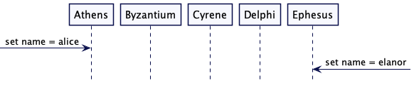

考虑一个由五个节点组成的集群：Athens、Byzantium、Cyrene、Delphi 和 Ephesus。 客户端联系Athens节点，请求将名称设置为“alice”。 Athens节点现在需要发起一个 Paxos 交互来查看是否所有节点都同意这个改变。 雅典被称为提议者，因为雅典将向所有其他节点提议集群的名称为“alice”。 集群中的所有节点（包括Athens）都是“接受者”，这意味着它们能够接受提案。

在Athens提出“alice”的同时，节点 Ephesus 收到了将名称设置为“elanor”的请求。 这使得Athens也成为提议者。如上图图所示。


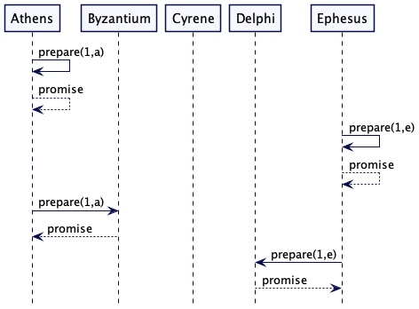

在准备阶段，提议者首先发送一些准备请求，这些请求都包含一个Generation数。 由于 *Paxos* 旨在避免单点故障，因此我们不会从单一的Generation Clock中获取Generation数。 相反，每个节点都维护自己的Generation Clock中，其中将生成编号与节点 ID 组合在一起。 节点 ID 用于打破平局，因此 [2,a] > [1,e] > [1,a]。 每个接受者都记录它迄今为止看到的最新承诺。

| Node                | Athens | Byzantium | Cyrene | Delphi | Ephesus |
| ------------------- | ------ | --------- | ------ | ------ | ------- |
| promised generation | 1,a    | 1,a       | 0      | 1,e    | 1,e     |
| accepted value      | none   | none      | none   | none   | none    |

​		

由于在此之前他们没有看到任何请求，因此他们都向调用提议者返回了一个承诺。 我们将返回的值称为“承诺”，因为它表明接受者承诺不考虑任何具有比承诺的更早Generation Clock的消息。

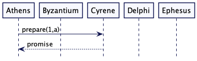

*Athens* 将其准备信息发送给*Cyrene*。 当它收到一个承诺作为回报时，这意味着它现在已经从五个节点中的三个节点获得了承诺，这代表了一个法定人数。 *Athens*现在从发送准备消息转变为发送接受消息。

*Athens* 有可能未能收到大多数集群节点的承诺。 在这种情况下，*Athens* 通过增加生成时钟来重试准备请求。

| Node                | Athens | Byzantium | Cyrene | Delphi | Ephesus |
| ------------------- | ------ | --------- | ------ | ------ | ------- |
| promised generation | 1,a    | 1,a       | 1,a    | 1,e    | 1,e     |
| accepted value      | none   | none      | none   | none   | none    |


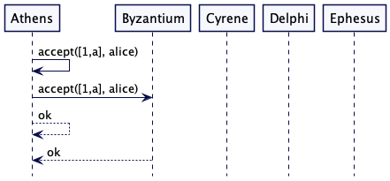

Athens现在开始发送accept 消息，其中包含generation和proposed value，*Athens*和*Byzantium*接受了这个提议。

| Node                | Athens | Byzantium | Cyrene | Delphi | Ephesus |
| ------------------- | ------ | --------- | ------ | ------ | ------- |
| promised generation | 1,a    | 1,a       | 1,a    | 1,e    | 1,e     |
| accepted value      | alice  | alice     | none   | none   | none    |


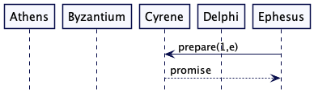

*Ephesus* 现在向 *Cyrene* 发送一条准备消息。 Cyrene曾向雅典发出过承诺，但以弗所的要求更高一辈，所以优先。 昔兰尼向以弗所发回了一个承诺。

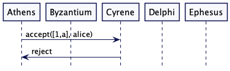

Cyrene 现在收到了来自Athens 的accept 请求，但Cyrene 拒绝了它，因为generation 数落后于其对Ephesus的承诺。

| Node                | Athens | Byzantium | Cyrene | Delphi | Ephesus |
| ------------------- | ------ | --------- | ------ | ------ | ------- |
| promised generation | 1,a    | 1,a       | 1,e    | 1,e    | 1,e     |
| accepted value      | alice  | alice     | none   | none   | none    |


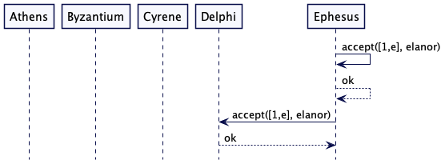

Ephesus 现在已经从它的准备消息中获得了一个法定人数，所以可以继续发送接受。 它向自己和 Delphi 发送accepts ，如上图所示，但在它可以发送更多accepts之前崩溃 ，当前系统状态如下表。

| Node                | Athens | Byzantium | Cyrene | Delphi | Ephesus |
| ------------------- | ------ | --------- | ------ | ------ | ------- |
| promised generation | 1,a    | 1,a       | 1,e    | 1,e    | 1,e     |
| accepted value      | alice  | alice     | none   | elanor | elanor  |


与此同时，Athens不得不处理来自Cyrene的对accepts 请求的拒绝(rejects)响应。 这表明不再向其承诺其法定人数，因此其提议将失败。 像这样失去初始法定人数的提议者总是会发生这种情况； 对于另一个提议者达到法定人数，第一个提议者的法定人数中至少有一个成员将缺席。


在一个简单的两阶段提交的情况下，我们会期望 Ephesus 继续并选择它的值，但是由于 Ephesus 已经崩溃，这样的方案现在会遇到麻烦。 如果它锁定了法定人数的接受者，它的崩溃将使整个提案过程陷入僵局。 然而，Paxos 预计这种事情会发生，因此Athens将再次尝试，这次是与更高的一代，如下图所示。

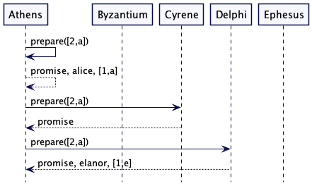

如上图所示，它再次发送prepare 消息，但这次使用更高的*generation*。 与第一轮一样，它返回了三个承诺，但有一个重要的区别。 Athens早已经接受了“alice”，而Delphi已经接受了“elanor”。 这两个接受者都返回一个承诺，还有他们已经接受的值，以及接受的提议的代号。 当他们返回该值时，他们将他们承诺的一代更新为 [2,a] 以反映他们对雅典做出的承诺。

| Node                | Athens | Byzantium | Cyrene | Delphi | Ephesus |
| ------------------- | ------ | --------- | ------ | ------ | ------- |
| promised generation | 2,a    | 1,a       | 2,a    | 2,a    | 1,e     |
| accepted value      | alice  | alice     | none   | elanor | elanor  |

具有法定人数的*Athens*现在必须进入接受阶段，但它必须提出已经被接受的、最高的*Generation*的值，即“elanor”，他被Delphi以[1，e]的一代接受，这 大于Athens对 [1,a] 的“爱丽丝”的接受度。如下图所示。

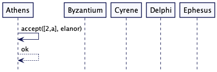

*Athens*开始发出接受请求，但现在是“*elanor*”及其当前一代。 Athens向自己发送一个接受请求，该请求被接受。 这是一个至关重要的接受，因为现在有三个节点接受“elanor”，这是“elanor”的法定人数，因此我们可以认为“elanor”是选择的值。

| Node                | Athens | Byzantium | Cyrene | Delphi | Ephesus |
| ------------------- | ------ | --------- | ------ | ------ | ------- |
| promised generation | 2,a    | 1,a       | 2,a    | 2,a    | 1,e     |
| accepted value      | elanor | alice     | none   | elanor | elanor  |

但是，尽管“elanor”现在是选择的值，但还没有人意识到它。 在接受阶段，*Athens*只知道自己具有“elanor”作为值，这不是法定人数，*Ephesus* 处于离线状态。Athens需要做的就是接受更多的接受请求，然后它就可以提交了。 但现在*Athens*崩溃了。

此时Athens和Ephesus 现已崩溃。 但是集群仍然有一定数量的节点在运行，所以它们应该能够继续工作，并且实际上通过遵循协议，他们可以发现“elanor”是选择的值。

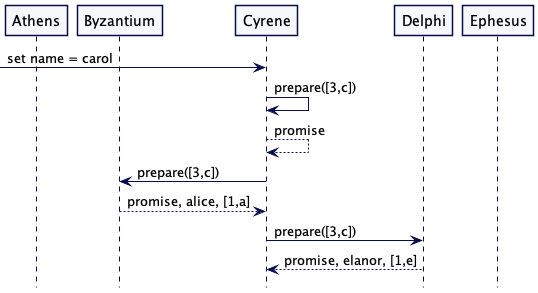

Cyrene 收到将名称设置为“carol”的请求，因此它成为提议者。 它已经看到了第 [2,a] 代，因此它开始了第 [3,c] 代的准备阶段。 虽然它希望提出“carol”作为名称，但目前它只是发出准备请求。

Cyrene 将准备消息发送到集群中的其余节点。 与Athens早期的准备阶段一样，***Cyrene 得到了被接受的值***，因此“carol”永远不会被提议为值。 和以前一样，Delphi 的“elanor”晚于*Byzantium*的“alice”，因此 Cyrene 以“elanor”和 [3,c] 开始接受阶段，当前状态如下表所示。请求序列图如下图所示。

| Node                | Athens | Byzantium | Cyrene | Delphi | Ephesus |
| ------------------- | ------ | --------- | ------ | ------ | ------- |
| promised generation | 2,a    | 3,c       | 3,c    | 3,c    | 1,e     |
| accepted value      | elanor | alice     | none   | elanor | elanor  |

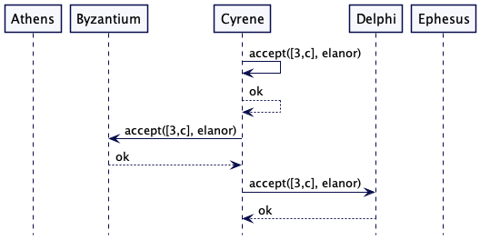

虽然我可以继续崩溃并唤醒节点，但现在很明显“elanor”将胜出。 只要达到法定人数的节点，其中至少有一个将具有“elanor”作为其值，并且任何尝试准备的节点都必须联系一个接受“elanor”的节点以获得的法定人数。 因此，我们将以 Cyrene 发送提交来结束。如下图所示。

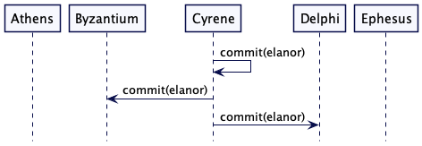

在某个时候，Athens和Ephesus会重新上线，他们会发现quorum选择了什么。

### 请求不需要被拒绝

在上面的例子中，我们看到接受者拒绝了老一代的请求。但是该协议不需要像这样的明确拒绝。按照公式，接受者可能会忽略一个过期的请求。如果是这种情况，那么协议仍将收敛于单一共识值。这是协议的一个重要特性，因为这是一个分布式系统，连接可能随时丢失，因此不依赖拒绝以确保协议的安全性是有益的。 （这里的安全意味着协议只会选择一个值，一旦选择，它就不会被覆盖。）

但是，发送拒绝仍然有用，因为它可以提高性能。提议者越快发现他们老了，他们就能越早开始新一轮的更高一代。

### 竞争的提议者可能无法选择
该协议可能出错的一种方式是如果两个（或更多）提议者进入一个循环。

alice 被athens 和byzantium接受
elanor 由所有节点准备，防止 alice 获得法定人数
elanor 被 delphi 和ephesus接受
alice 由所有节点准备，防止 elanor 获得法定人数。
alice 被athens 和byzantium接受
...等等，这种情况称为livelock
 [FLP Impossibility Result](https://groups.csail.mit.edu/tds/papers/Lynch/jacm85.pdf)表明，即使是单个故障节点也可以阻止集群选择值。

我们可以通过确保每当提议者需要选择新的一代值时候，它必须等待一段随机时间来减少这种活锁发生的机会。这种随机性使得一个提议者很可能能够在另一个提议者向完整法定人数发送准备请求之前获得法定人数。

但是我们永远无法确保不会发生活锁。这是一个基本的权衡：我们可以确保safety 安全或liveness活性，但不能同时确保两者。 Paxos 确保安全第一。

### 键值存储示例

这里解释的 *Paxos* 协议在单个值上建立共识（通常称为*single-decree Paxos*）。 在 Cosmos DB 或 Spanner 等主流产品中使用的大多数实际实现都使用了一种称为 multi-paxos 的 paxos 修改，它被实现为 *Replicated Log*。

但是可以使用基本的 *Paxos* 构建一个简单的键值对存储。 [cassandra] 以类似的方式使用基本的 *Paxos* 来实现它的轻量级事务。

键值存储为每个键维护了一个Paxos 实例。（The key-value store maintains Paxos instance per key.）

class ***PaxosPerKeyStore***…

```java
  int serverId;
  public PaxosPerKeyStore(int serverId) {
      this.serverId = serverId;
  }

  Map<String, Acceptor> key2Acceptors = new HashMap<String, Acceptor>();
  List<PaxosPerKeyStore> peers;
```

Acceptor 存储promizedGeneration、acceptedGeneration 和acceptedValue。

class Acceptor…

```java
  public class Acceptor {
      //单调的Generation
      MonotonicId promisedGeneration = MonotonicId.empty();
  
      Optional<MonotonicId> acceptedGeneration = Optional.empty();
      Optional<Command> acceptedValue = Optional.empty();
  
      Optional<Command> committedValue = Optional.empty();
      Optional<MonotonicId> committedGeneration = Optional.empty();
  
      public AcceptorState state = AcceptorState.NEW;
      private BiConsumer<Acceptor, Command> kvStore;
```

当 key 和 value 放入 kv 存储时，它运行 Paxos 协议。

class PaxosPerKeyStore…

```java
  int maxKnownPaxosRoundId = 1;
  int maxAttempts = 4;
  public void put(String key, String defaultProposal) {
      int attempts = 0;
      while(attempts <= maxAttempts) {
          attempts++;
          MonotonicId requestId = new MonotonicId(maxKnownPaxosRoundId++, serverId);
          SetValueCommand setValueCommand = new SetValueCommand(key, defaultProposal);

          if (runPaxos(key, requestId, setValueCommand)) {
              return;
          }

          Uninterruptibles.sleepUninterruptibly(ThreadLocalRandom.current().nextInt(100), MILLISECONDS);
          logger.warn("Experienced Paxos contention. Attempting with higher generation");
      }
      throw new WriteTimeoutException(attempts);
  }

  private boolean runPaxos(String key, MonotonicId generation, Command initialValue) {
      List<Acceptor> allAcceptors = getAcceptorInstancesFor(key);
      List<PrepareResponse> prepareResponses = sendPrepare(generation, allAcceptors);
      if (isQuorumPrepared(prepareResponses)) {
          Command proposedValue = getValue(prepareResponses, initialValue);
          if (sendAccept(generation, proposedValue, allAcceptors)) {
              sendCommit(generation, proposedValue, allAcceptors);
          }
          if (proposedValue == initialValue) {
              return true;
          }
      }
      return false;
  }

  public Command getValue(List<PrepareResponse> prepareResponses, Command initialValue) {
      PrepareResponse mostRecentAcceptedValue = getMostRecentAcceptedValue(prepareResponses);
      Command proposedValue
              = mostRecentAcceptedValue.acceptedValue.isEmpty() ?
              initialValue : mostRecentAcceptedValue.acceptedValue.get();
      return proposedValue;
  }

  private PrepareResponse getMostRecentAcceptedValue(List<PrepareResponse> prepareResponses) {
      return prepareResponses.stream().max(Comparator.comparing(r -> r.acceptedGeneration.orElse(MonotonicId.empty()))).get();
  }
```

class Acceptor…

```java
  public PrepareResponse prepare(MonotonicId generation) {

      if (promisedGeneration.isAfter(generation)) {
          return new PrepareResponse(false, acceptedValue, acceptedGeneration, committedGeneration, committedValue);
      }
      promisedGeneration = generation;
      state = AcceptorState.PROMISED;
      return new PrepareResponse(true, acceptedValue, acceptedGeneration, committedGeneration, committedValue);

  }
```

class Acceptor…

```java
  public boolean accept(MonotonicId generation, Command value) {
      if (generation.equals(promisedGeneration) || generation.isAfter(promisedGeneration)) {
          this.promisedGeneration = generation;
          this.acceptedGeneration = Optional.of(generation);
          this.acceptedValue = Optional.of(value);
          return true;
      }
      state = AcceptorState.ACCEPTED;
      return false;
  }
```

只有在可以成功提交时，该值才会存储在 kvstore 中。

class Acceptor…

```java
  public void commit(MonotonicId generation, Command value) {
      committedGeneration = Optional.of(generation);
      committedValue = Optional.of(value);
      state = AcceptorState.COMMITTED;
      kvStore.accept(this, value);
  }
```

class PaxosPerKeyStore…

```java
  private void accept(Acceptor acceptor, Command command) {
      if (command instanceof SetValueCommand) {
          SetValueCommand setValueCommand = (SetValueCommand) command;
          kv.put(setValueCommand.getKey(), setValueCommand.getValue());
      }
      acceptor.resetPaxosState();
  }
```

paxos 状态需要被持久化。 它可以通过使用预写日志轻松完成。

### 处理多个值

需要注意的是，Paxos 特定于并被证明可以在单个值上工作。 因此，使用单值 Paxos 协议处理多个值需要在协议规范之外完成。 一种替代方法是重置状态，并分别存储已提交的值以确保它们不会丢失。

class Acceptor…

```java
  public void resetPaxosState() {
      //This implementation has issues if committed values are not stored
      //and handled separately in the prepare phase.
      //See Cassandra implementation for details.
      //https://github.com/apache/cassandra/blob/trunk/src/java/org/apache/cassandra/db/SystemKeyspace.java#L1232
      promisedGeneration = MonotonicId.empty();
      acceptedGeneration = Optional.empty();
      acceptedValue = Optional.empty();
  }
```

正如 [gryadka] 中所建议的，还有一个替代方案，它稍微修改了基本的 *Paxos* 以允许设置多个值。 执行基本算法之外的步骤的需要是在实践中首选复制日志的原因。

### 读取值

Paxos 依赖于准备阶段来检测任何未提交的值。 所以如果使用基本的Paxos来实现如上所示的key-value存储，那么读操作也需要运行完整的Paxos算法。

class PaxosPerKeyStore…

```java
  public String get(String key) {
      int attempts = 0;
      while(attempts <= maxAttempts) {
          attempts++;
          MonotonicId requestId = new MonotonicId(maxKnownPaxosRoundId++, serverId);
          Command getValueCommand = new NoOpCommand(key);
          if (runPaxos(key, requestId, getValueCommand)) {
              return kv.get(key);
          }

          Uninterruptibles.sleepUninterruptibly(ThreadLocalRandom.current().nextInt(100), MILLISECONDS);
          logger.warn("Experienced Paxos contention. Attempting with higher generation");
      }
      throw new WriteTimeoutException(attempts);
  }
```


## 例子

[cassandra] 使用 *Paxos* 实现轻量级事务。

所有像 *Raft* 这样的共识算法都使用类似于基本 *Paxos* 的基本概念。 以类似方式使用两阶段提交、仲裁和生成时钟。

笔记
1：灵活的Paxos：Paxos 的原始描述在准备和接受阶段都需要多数仲裁。 Heidi Howard 和其他人最近的一些工作表明，Paxos 的主要要求是在准备阶段和接受阶段的法定人数中有重叠。 只要满足此要求，就不需要两个阶段的多数法定人数。