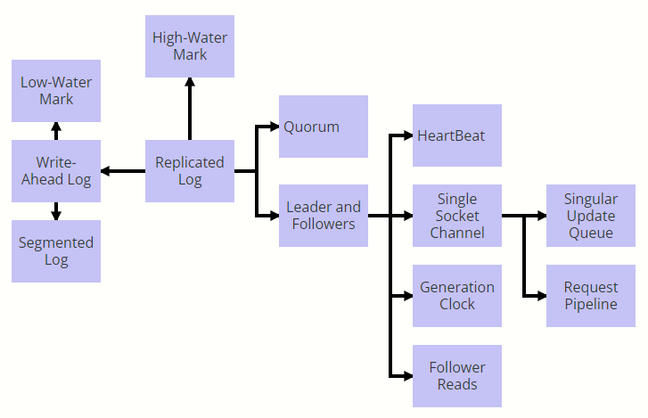
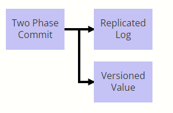
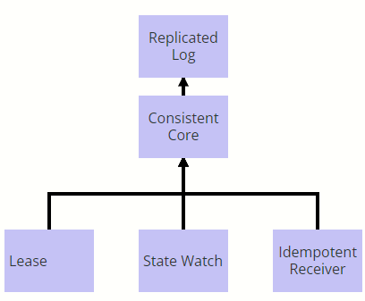
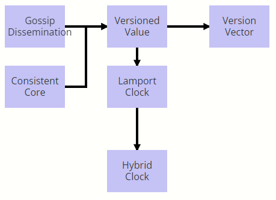

#  Patterns of Distributed Systems

​		分布式系统给软件开发带来了一些特殊的挑战，要求数据有多个副本，且彼此间要保持同步。然而，我们不能保证所有工作节点都能可靠地工作，网络延迟会轻易地造成不一致。尽管如此，许多组织依然要依赖一系列核心的分布式软件来处理数据存储、消息通信、系统管理以及计算能力。这些系统面临着共同的问题，可以采用类似的方案解决。本文将这些方案进行分类，并进一步提炼成模式。通过模式，我们可以认识到如何更好的理解、交流和传授分布式系统设计。

[TOC]

## 这个系列在讨论什么

在过去的几个月里，我一直在 Thoughtworks 举办关于分布式系统的研讨会。举办研讨会时面临的主要挑战之一是如何将分布式系统的理论映射到 Kafka 或 Cassandra 等开源代码库，同时保持讨论的通用性足以涵盖广泛的解决方案。模式的概念提供了一个很好的出路。

就其本质而言，模式结构使我们能够专注于特定问题，从而非常清楚为什么需要特定解决方案。然后解决方案描述使我们能够给出一个代码结构，它足够具体以显示实际的解决方案，但又足够通用以涵盖广泛的变化。这种模式技术还允许我们将各种模式链接在一起以构建一个完整的系统。这为讨论分布式系统实现提供了一个很好的词汇。

以下是在主流开源分布式系统中观察到的第一组模式。我希望这组模式对所有开发人员都有用。

## 分布式系统 - 实施视角

今天的企业架构充满了自然而然的分布式的平台和框架。如果从今天典型的企业应用架构选取典型平台和框架组成列表，我们可能会得到类似于下面这样一个列表：

| Type of platform/framework   | Example                                    |
| :--------------------------- | :----------------------------------------- |
| Databases                    | Cassandra, HBase, Riak                     |
| Message Brokers              | Kafka, Pulsar                              |
| Infrastructure               | Kubernetes, Mesos, Zookeeper, etcd, Consul |
| In Memory Data/Compute Grids | Hazelcast, Pivotal Gemfire                 |
| Stateful Microservices       | Akka Actors, Axon                          |
| File Systems                 | HDFS, Ceph                                 |

所有这些都是天生“分布式”的。 分布式系统意味着什么？ 有两个方面：

* 它们在多台服务器上运行。 集群中的服务器数量可以从少至三台服务器到几千台服务器不等。
* 他们管理数据。 所以这些本质上是“有状态的”系统。

​		当多个服务器参与存储数据时，有几种方法可能会出错。 上述所有系统都需要解决这些问题。 这些系统的实施对这些问题有一些反复出现的解决方案。 以一般形式理解这些解决方案有助于理解这些系统的广泛实施，并且在需要构建新系统时也可以作为很好的指导。 输入模式。

## 模式

模式是 Christopher Alexander 引入的一个概念，在软件社区中被广泛接受，用于记录用于构建软件系统的设计结构。 模式提供了一种结构化的方式来查看问题空间以及多次看到并经过验证的解决方案。 使用模式的一种有趣方式是能够以模式序列或模式语言的形式将多个模式链接在一起，这为实现“整体”或完整系统提供了一些指导。 将分布式系统视为一系列模式是深入了解其实现的有用方法。

## 问题及其反复出现的解决方案

当数据存储在多台服务器上时，可能会出现一些问题。

### 进程崩溃

由于硬件故障或软件故障，进程可能随时崩溃。进程崩溃的方式有很多种。

* 系统管理员可以将其取下以进行日常维护。
* 由于磁盘已满且未正确处理异常，因此可能会在执行某些文件 IO 时将其杀死。

​	在云环境中，它可能更加棘手，因为一些不相关的事件可能会导致服务器停机。底线是，如果进程负责存储数据，则必须将它们设计为为存储在服务器上的数据提供持久性保证。即使一个进程突然崩溃，它也应该保留它已通知用户它已成功存储的所有数据。根据访问模式，不同的存储引擎具有不同的存储结构，从简单的哈希映射到复杂的图存储。由于将数据刷新到磁盘是最耗时的操作之一，因此并非每次对存储的插入或更新都可以刷新到磁盘。所以大多数数据库都有内存中的存储结构，这些结构只会定期刷新到磁盘。如果进程突然崩溃，这会带来丢失所有数据的风险。

​	一种称为预写日志的技术用于解决这种情况。服务器将每个状态更改作为命令存储在硬盘上的仅附加文件中。附加文件通常是一个非常快的操作，因此可以在不影响性能的情况下完成。按顺序附加的单个日志用于存储每个更新。在服务器启动时，可以重播日志以再次构建内存状态。

​	这提供了耐用性保证。即使服务器突然崩溃然后重新启动，数据也不会丢失。但是在服务器备份之前，客户端将无法获取或存储任何数据。所以我们在服务器故障的情况下缺乏可用性。

​	显而易见的解决方案之一是将数据存储在多个服务器上。所以我们可以在多台服务器上复制预写日志。

当涉及多个服务器时，需要考虑更多的故障场景。

### 网络延迟

​	在 TCP/IP 协议栈中，通过网络传输消息所导致的延迟没有上限。它可以根据网络上的负载而变化。例如，1 Gbps 网络链接可能会被触发的大数据作业淹没，从而填充网络缓冲区，这可能导致某些消息到达服务器的任意延迟。

​	在典型的数据中心中，服务器被打包在机架中，并且有多个机架通过架顶式交换机连接。可能有一棵交换机树将数据中心的一部分连接到另一部分。在某些情况下，一组服务器可以相互通信，但与另一组服务器断开连接。这种情况称为网络分区。服务器通过网络进行通信的基本问题之一是如何知道特定服务器发生故障。

这里有两个问题需要解决。

* 一个特定的服务器不能无限期地等待知道另一台服务器是否已经崩溃。
* 不应该有两组服务器，每组都认为另一组发生故障，因此继续为不同的客户端组提供服务。这被称为裂脑。

​	为了解决第一个问题，每个服务器都会定期向其他服务器发送 *HeartBeat* 消息。如果错过了心跳，则发送心跳的服务器被认为已崩溃。心跳间隔足够小，以确保不会花费大量时间来检测服务器故障。正如我们将在下面看到的，在最坏的情况下，服务器可能会启动并运行，但考虑到服务器出现故障，集群作为一个组可以继续前进。这样可以确保向客户提供的服务不会中断。

​	第二个问题是脑裂。使用裂脑，如果两套服务器独立接受更新，不同的客户端可以获取和设置不同的数据，一旦裂脑解决，就无法自动解决冲突。

​	要解决脑裂问题，我们必须确保彼此断开连接的两组服务器不应该能够独立取得进展。为了确保这一点，只有当大多数服务器可以确认该操作时，服务器采取的每个操作才被认为是成功的。如果服务器无法获得多数，它们将无法提供所需的服务，并且某些客户端可能无法接收服务，但集群中的服务器将始终处于一致状态。占多数的服务器数量称为法定人数。如何决定法定人数(*Quorum*)？这是根据集群可以容忍的故障数量决定的。因此，如果我们有一个由五个节点组成的集群，我们需要三个法定人数。一般来说，如果我们想容忍 f 个故障，我们需要一个 2f + 1 的集群大小。

*Quorum* 确保我们有足够的数据副本来承受一些服务器故障。但是这不足以给客户端提供强一致性保证。假设客户端在quorum上启动写操作，但写操作仅在一台服务器上成功。quorum中的其他服务器仍然具有旧值。当客户端从quorum读取值时，如果具有最新值的服务器可用，它可能会获取最新值。但是如果在客户端开始读取该值时，具有最新值的服务器不可用，则它可以很好地获取旧值。为了避免这种情况，有人需要跟踪quorum是否同意特定操作，并且只向客户端发送保证在所有服务器上可用的值。在这种情况下使用*领导者和追随者。*其中一个服务器被选为领导者，其他服务器充当追随者。领导者控制和协调追随者上的复制。领导者现在需要决定哪些更改应该对客户可见。*高水位标记*用于跟踪已知已成功复制到法定数量的追随者的预写日志中的条目。客户可以看到所有达到高水位线的条目。领导者还将高水位标记传播给追随者。因此，如果领导者失败并且其中一个追随者成为新的领导者，客户端看到的内容不会出现不一致。

###  进程暂停

​	即使有法定人数、领导者和追随者，也有一个棘手的问题需要解决。领导进程可以任意暂停。进程暂停的原因有很多。对于支持垃圾收集的语言，可能会有很长的垃圾收集暂停。一个长时间的垃圾回收暂停的领导者，可以与追随者断开连接，并在暂停结束后继续向追随者发送消息。同时，由于追随者没有收到领导者的心跳，他们可能已经选举了一个新的领导者并接受了来自客户端的更新。如果来自旧领导者的请求按原样处理，它们可能会覆盖一些更新。所以我们需要一种机制来检测来自过时领导者的请求。在这里，*Generation Clock* 用于标记和检测来自老领导的请求。世代是一个单调递增的数字。

### 不同步的时钟和排序事件

​	从较新的领导者消息中检测较旧的领导者消息的问题是维护消息顺序的问题。看起来我们可以使用系统时间戳来排序一组消息，但我们不能。我们不能使用系统时钟的主要原因是不能保证跨服务器的系统时钟是同步的。计算机中的时钟由石英晶体管理，并根据晶体的振荡测量时间。

​	这种机制很容易出错，因为晶体可以更快或更慢地振荡，因此不同的服务器可以有非常不同的时间。一组服务器上的时钟由称为 NTP 的服务同步。该服务定期检查一组全球时间服务器，并相应地调整计算机时钟。

​	由于通过网络进行通信时会发生这种情况，并且网络延迟可能会有所不同，如以上部分所述，因此时钟同步可能会因网络问题而延迟。这可能会导致服务器时钟彼此偏离，并且在 NTP 同步发生后，甚至会及时向后移动。由于计算机时钟的这些问题，一天中的时间通常不用于排序事件。取而代之的是一种称为 *Lamport Clock* 的简单技术。*世代时钟*就是一个例子。 *Lamport Clocks* 只是简单的数字，仅当系统中发生某些事件时才会增加。在数据库中，事件是关于写入和读取值的，因此Lamport Clocks仅在写入值时递增。 *Lamport Clock* 编号也在发送给其他进程的消息中传递。然后，接收进程可以选择两个数字中较大的一个，即它在消息中接收的一个和它维护的一个。通过这种方式，*Lamport Clocks* 还可以跟踪相互通信的进程之间的事件之间的发生前关系。这方面的一个例子是参与事务的服务器。虽然 *Lamport Clock* 允许对事件进行排序，但它与时钟的时间没有任何关系。为了弥补这一差距，使用了一种称为混合时钟的变体。混合时钟 [Hybrid Clock]使用系统时间和一个单独的数字来确保值单调增加，并且可以像 *Lamport Clock* 一样使用。

Lamport Clock 允许确定跨一组通信服务器的事件顺序。但它不允许检测跨一组副本发生的对相同值的并发更新。版本向量用于检测一组副本之间的冲突。Lamport Clock或版本向量需要与存储的值相关联，以检测哪些值存储在另一个之后或是否存在冲突。因此服务器将值存储为版本化值。

## 把它们放在一起——模式序列

我们可以看到理解这些模式如何帮助我们从头开始构建一个完整的系统。我们将以共识实施为例。

### 容错共识

​	分布式共识是分布式系统实现的一个特例，它提供了最强的一致性保证。在流行的企业系统中常见的例子包括 Zookeeper、etcd 和 Consul。他们实现了诸如zab和Raft之类的共识算法来提供复制和强一致性。还有其他流行的算法来实现共识； *multi-paxos* 用于 Google 的 Chubby 锁定服务、*视图标记复制 view stamp replication*和虚拟同步 [virtual-synchrony](https://www.cs.cornell.edu/ken/History.pdf)。用非常简单的术语来说，共识是指一组服务器，它们就存储的数据、存储数据的顺序以及何时使该数据对客户端可见。

​	假设一个崩溃故障模型，假设集群节点在任何故障发生时停止工作并崩溃，实现单个值共识的基本技术是作为 Paxos 实现的。 Paxos 描述了一些使用两阶段执行（Quorum 和 Generation Clock）的简单规则，即使在存在进程崩溃、网络延迟和时钟不同步的情况下，也可以在一组集群节点之间达成共识。

当数据跨集群节点复制时，仅就单个值达成共识是不够的。 所有副本都需要就所有数据达成一致。 这需要在保持严格顺序的同时多次执行 Paxos。 Replicated Log 描述了如何扩展基本的 Paxos 来实现这一点。

这种技术也称为状态机复制以实现容错。 在状态机复制中，存储服务，如键值存储，在所有服务器上复制，用户输入在每台服务器上以相同的顺序执行。 用于实现此目的的关键实现技术是在所有服务器上复制预写日志以具有复制日志。

### 用于实现复制日志的*模式序列*

我们可以将这些模式放在一起来实现 Replicated Wal，如下所示。

为了提供持久性保证，您可以使用 Write-Ahead Log 模式。使用分段日志将预写日志分为多个段。这有助于日志清理，由 Low-Water Mark 处理。通过在多个服务器上复制预写日志来提供容错。服务器之间的复制使用领导者和追随者模式进行管理，并且Quorum用于更新高水位标记以确定哪些值对客户端可见。通过使用单一更新队列，所有请求都按照严格的顺序进行处理。使用单套接字通道将请求从领导者发送到追随者时，顺序保持不变。为了优化单个套接字通道的吞吐量和延迟，可以使用请求管道。追随者通过从领导者那里收到的心跳知道领导者的可用性。如果leader因为网络分区而暂时与集群断开连接，则使用Generation Clock进行检测。如果所有请求仅由领导者提供服务，它可能会超载。当客户端是只读的并且允许读取过时的值时，它们可以由跟随服务器提供服务。跟随者读取允许处理来自跟随者服务器的读取请求。

### 原子提交

当多个集群节点都存储相同的数据时，共识算法很有用。通常，数据量太大而无法在单个节点上存储和处理。因此，数据使用各种分区方案（如固定分区或键范围分区）跨一组节点进行分区。为了实现容错，每个分区还使用 Replicated Log 跨几个集群节点进行复制。

有时需要将跨一组分区的数据存储为一个原子操作。如果存储分区的进程崩溃或存在网络延迟或进程暂停，则可能会发生数据在几个分区上复制并在几个分区上失败的情况。为了保持原子性，需要在所有分区上存储数据并使其可访问或不访问。两阶段提交用于保证跨一组分区的原子性。为了保证原子性，两阶段提交通常需要锁定所涉及的数据项。这会严重影响吞吐量，尤其是在长时间运行的只读操作持有锁时。为了在不使用冲突锁的情况下获得更好的吞吐量，两阶段提交实现通常使用基于版本化值[Versioned Value]()的存储。

### Kubernetes or Kafka 控制面

*Kubernetes* 或 *Kafka* 架构等产品是围绕高度一致的元数据存储构建的。 我们可以把它理解为一个模式序列。 *Consistent Core* 用作高度一致、容错的元数据存储。 *Lease* 用于实现集群节点的组成员关系和故障检测。 当任何集群节点发生故障或更新其元数据时，集群节点使用状态观察来获得通知一致的核心实现使用幂等接收器来忽略集群节点发送的重复请求，以防网络故障重试。 [*Consistent Core*](Consistent Core.md) 是使用“Replicated Wal”构建的，在上一节中将其描述为*模式序列*。

### 逻辑时间戳的使用

​		各种类型的逻辑时间戳的使用也可以看作是一个模式序列。 各种产品使用 Gossip Dissemination 或 Consistent Core 来进行集群节点的组成员身份和故障检测。 数据存储使用版本化值来确定哪些值是最新的。 如果单个服务器负责更新值或使用 Leader 和 Followers，则可以在 Versioned Value 中使用 Lamport Clock 作为版本。 当需要从一天中的时间导出时间戳值时，使用混合时钟而不是简单的 Lamport 时钟。 如果允许多个服务器处理客户端请求以更新相同的值，则使用版本向量能够检测不同集群节点上的并发写入。

这样，以一般形式理解问题及其反复出现的解决方案，有助于理解完整系统的构建块

## 下一步

分布式系统是一个广泛的话题。 这里介绍的模式集是一小部分，涵盖了不同的类别，以展示模式方法如何帮助理解和设计分布式系统。 我将继续添加模式到这个集合中，以广泛地包括在任何分布式系统中解决的以下类型的问题。

* 分组成员和故障检测
* 分区
* 复制和一致性
* 存储
* 处理