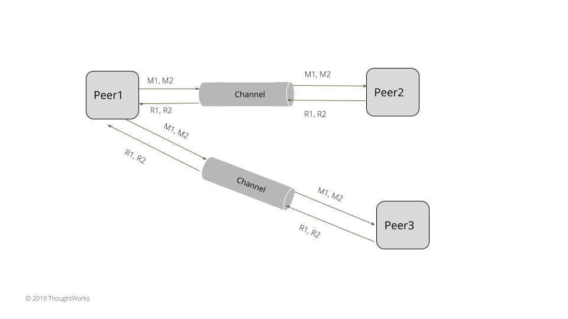

# Request Pipeline

通过在连接上发送多个请求而不等待先前请求的响应来改善延迟。


## 问题

如果请求需要等待响应以返回先前请求的响应，则使用单套接字通道在集群内的服务器之间进行通信可能会导致性能问题。 为了获得更好的吞吐量和延迟，服务器上的请求队列应该被填满，以确保服务器容量得到充分利用。 例如，当在服务器中使用单一更新队列时，它总是可以接受更多请求，直到队列填满，同时它正在处理请求。 如果一次只发送一个请求，则大部分服务器容量都被不必要地浪费了。


## 解决方案

节点向其他节点发送请求，而无需等待先前请求的响应。 这是通过创建两个单独的线程来实现的，一个用于通过网络通道发送请求，另一个用于从网络通道接收响应。



class SingleSocketChannel…

```java
  public void sendOneWay(RequestOrResponse request) throws IOException {
      var dataStream = new DataOutputStream(socketOutputStream);
      byte[] messageBytes = serialize(request);
      dataStream.writeInt(messageBytes.length);
      dataStream.write(messageBytes);
  }
```

启动一个单独的线程来读取响应。

class ResponseThread…

```java
  class ResponseThread extends Thread implements Logging {
      private volatile boolean isRunning = false;
      private SingleSocketChannel socketChannel;

      public ResponseThread(SingleSocketChannel socketChannel) {
          this.socketChannel = socketChannel;
      }

      @Override
      public void run() {
          try {
              isRunning = true;
              logger.info("Starting responder thread = " + isRunning);
              while (isRunning) {
                  doWork();
              }

          } catch (IOException e) {
              e.printStackTrace();
              getLogger().error(e); //thread exits if stopped or there is IO error
          }
      }

      public void doWork() throws IOException {
          RequestOrResponse response = socketChannel.read();
          logger.info("Read Response = " + response);
          processResponse(response);
      }
```

响应处理程序可以立即处理响应或将其提交到单一更新队列

请求管道有两个问题需要处理。

如果在不等待响应的情况下连续发送请求，则接受请求的节点可能会不堪重负。 出于这个原因，一次可以保留多少个请求是有上限的。 任何节点最多可以向其他节点发送最大数量的请求。 一旦发送了最大的飞行请求而没有收到响应，则不再接受请求并且发送者被阻止。 限制最大飞行请求的一个非常简单的策略是保持一个阻塞队列来跟踪请求。 队列使用可以进行的请求数进行初始化。 一旦收到请求的响应，它就会从队列中删除，以便为更多请求腾出空间。 如以下代码所示，每个套接字连接最多接受五个飞行中的请求。

class RequestLimitingPipelinedConnection…

```java
  private final Map<InetAddressAndPort, ArrayBlockingQueue<RequestOrResponse>> inflightRequests = new ConcurrentHashMap<>();
  private int maxInflightRequests = 5;
  public void send(InetAddressAndPort to, RequestOrResponse request) throws InterruptedException {
      ArrayBlockingQueue<RequestOrResponse> requestsForAddress = inflightRequests.get(to);
      if (requestsForAddress == null) {
          requestsForAddress = new ArrayBlockingQueue<>(maxInflightRequests);
          inflightRequests.put(to, requestsForAddress);
      }
      requestsForAddress.put(request);
```

一旦收到响应，该请求就会从正在进行的请求队列中删除。

class RequestLimitingPipelinedConnection…

```java
  private void consume(SocketRequestOrResponse response) {
      Integer correlationId = response.getRequest().getCorrelationId();
      Queue<RequestOrResponse> requestsForAddress = inflightRequests.get(response.getAddress());
      RequestOrResponse first = requestsForAddress.peek();
      if (correlationId != first.getCorrelationId()) {
          throw new RuntimeException("First response should be for the first request");
      }
      requestsForAddress.remove(first);
      responseConsumer.accept(response.getRequest());
  }
```

处理故障和维护排序保证变得难以实现。 假设有两个请求在进行中。 第一个请求失败并重试，服务器可能在重试的第一个请求到达服务器之前已经处理了第二个请求。 服务器需要一些机制来确保乱序请求被拒绝。 否则，在失败和重试的情况下，总是有消息被重新排序的风险。 例如，Raft 总是发送每个日志条目所期望的前一个日志索引。 如果之前的日志索引不匹配，则服务器拒绝该请求。 Kafka 可以允许 max.in.flight.requests.per.connection 不止一个，使用幂等生产者实现，它为发送到代理的每个消息批次分配一个唯一标识符。 然后，代理可以检查传入请求的序列号，如果请求无序，则拒绝该请求。

## 例子

Zab 和 Raft 等所有共识算法都允许请求管道支持。

Kafka 鼓励客户使用请求管道来提高吞吐量