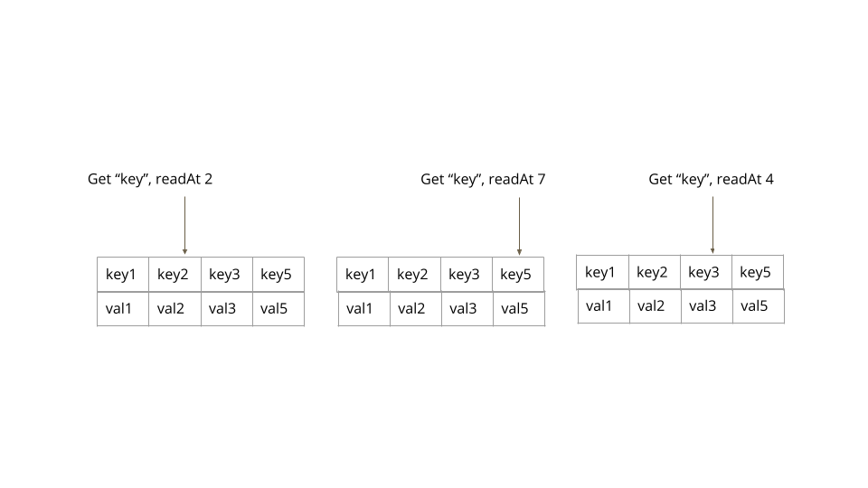
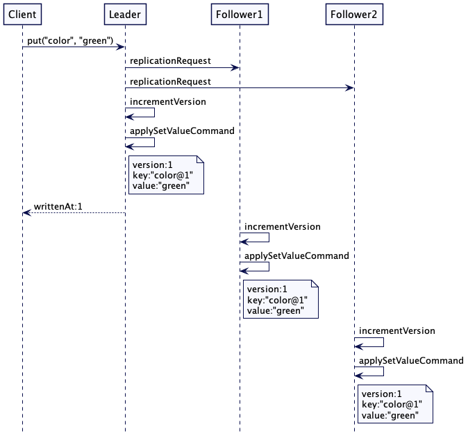
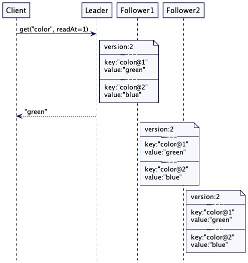
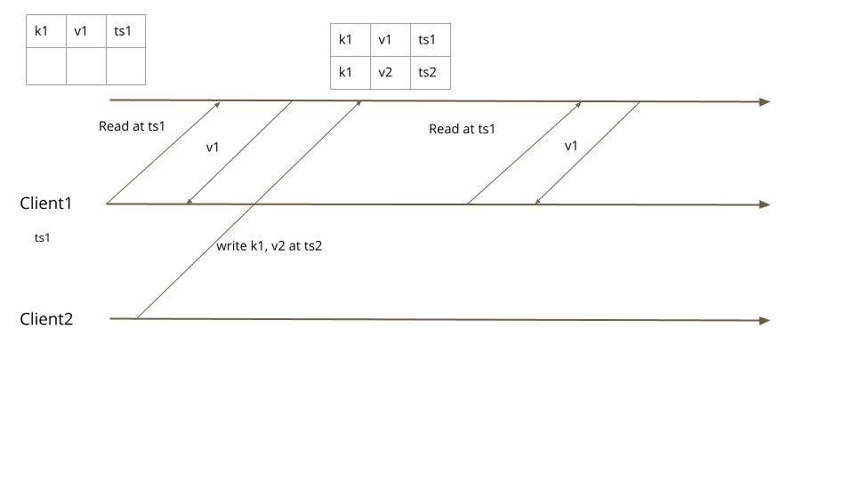

#  版本化值
使用新版本将每个更新存储到一个值，以允许读取历史值。

[TOC]


## 问题

在分布式系统中，节点需要能够判断键的哪个值是最新的。 有时他们需要知道过去的价值，以便他们能够对价值的变化做出适当的反应


## 解决方案

为每个值存储一个版本号。每次更新都会增加版本号。这允许每次更新都转换为新的写入，而不会阻塞读取。客户端可以读取特定版本号的历史值。

考虑一个复制键值存储的简单示例。集群的领导者处理所有对键值存储的写入。它将写入请求保存在 Write-Ahead Log 中。使用领导者和追随者复制预写日志。领导者将高水位线的预写日志中的条目应用于键值存储。这是一种称为*状态机复制*的标准复制方法。大多数由共识算法（如 Raft）支持的数据系统都是以这种方式实现的。在这种情况下，键值存储保留一个整数版本计数器。每次从预写日志应用键值写入命令时，它都会增加版本计数器。然后它使用递增的版本计数器构造新Key。这种方式不会更新现有值，但每个写入请求都会继续将新值附加到后备存储。

class ReplicatedKVStore…

```java
  int version = 0;
  MVCCStore mvccStore = new MVCCStore();

  @Override
  public CompletableFuture<Response> put(String key, String value) {
      return server.propose(new SetValueCommand(key, value));
  }

  private Response applySetValueCommand(SetValueCommand setValueCommand) {
      getLogger().info("Setting key value " + setValueCommand);
      version = version + 1;
      mvccStore.put(new VersionedKey(setValueCommand.getKey(), version), setValueCommand.getValue());
      Response response = Response.success(version);
      return response;
  }
```


### 版本化Key的排序

```java
[rocksdb] 或 [boltdb] 等嵌入式数据存储通常用作数据库的存储层。 在这些存储中，所有数据在逻辑上按照键的排序顺序排列，与此处显示的实现非常相似。 因为这些存储使用基于字节数组的键和值，所以在将键序列化为字节数组时保持顺序很重要。
```

因为快速导航到最佳匹配版本是一个重要的实现问题，所以版本化的键的排列方式是通过使用版本号作为键的后缀来形成自然排序。 这保持了与底层数据结构非常吻合的顺序。 例如，如果一个键有两个版本，key1 和 key2，那么 key1 将排在 key2 之前。

为了存储版本化的键值，使用允许快速导航到最近匹配版本的数据结构，例如跳表。 在 Java 中，mvcc 存储可以如下构建：

class MVCCStore…

```
  public class MVCCStore {
      NavigableMap<VersionedKey, String> kv = new ConcurrentSkipListMap<>();
  
      public void put(VersionedKey key, String value) {
          kv.put(key, value);  
      }
```

要使用navigable map，版本化密钥的实现方式如下。 它实现了一个comparator 以允许键的自然排序。

class VersionedKey…

```
  public class VersionedKey implements Comparable<VersionedKey> {
      private String key;
      private long version;
  
      public VersionedKey(String key, long version) {
          this.key = key;
          this.version = version;
      }
  
      public String getKey() {
          return key;
      }
  
      public long getVersion() {
          return version;
      }
  
      @Override
      public int compareTo(VersionedKey other) {
          int keyCompare = this.key.compareTo(other.key);
          if (keyCompare != 0) {
              return keyCompare;
          }
          return Long.compare(this.version, other.version);
      }
  }
```

此实现允许使用 navigable map API 获取特定版本的值。

class MVCCStore…

```
  public Optional<String> get(final String key, final int readAt) {
      Map.Entry<VersionedKey, String> entry = kv.floorEntry(new VersionedKey(key, readAt));
      return (entry == null)? Optional.empty(): Optional.of(entry.getValue());
  }
```

考虑一个示例，其中密钥的四个版本存储在版本号 1、2、3 和 5 处。根据客户端用于读取值的版本，返回最接近的匹配版本的密钥。



将存储特定键值的版本返回给客户端。 然后客户端可以使用这个版本来读取值。 整体工作如下。



*Figure 2: Put Request Handling*




### 阅读多个版本

有时客户端需要从给定的版本号获取所有版本。 例如，在 State Watch 中，客户端需要从特定版本中获取所有事件。集群节点可以存储额外的索引结构来存储一个键的所有版本。

class IndexedMVCCStore…

```
  public class IndexedMVCCStore {
      NavigableMap<String, List<Integer>> keyVersionIndex = new TreeMap<>();
      NavigableMap<VersionedKey, String> kv = new TreeMap<>();
  
      ReadWriteLock rwLock = new ReentrantReadWriteLock();
      int version = 0;
  
      public int put(String key, String value) {
          rwLock.writeLock().lock();
          try {
              version = version + 1;
              kv.put(new VersionedKey(key, version), value);
  
              updateVersionIndex(key, version);
  
              return version;
          } finally {
              rwLock.writeLock().unlock();
          }
      }
  
      private void updateVersionIndex(String key, int newVersion) {
          List<Integer> versions = getVersions(key);
          versions.add(newVersion);
          keyVersionIndex.put(key, versions);
      }
  
      private List<Integer> getVersions(String key) {
          List<Integer> versions = keyVersionIndex.get(key);
          if (versions == null) {
              versions = new ArrayList<>();
              keyVersionIndex.put(key, versions);
          }
          return versions;
      }
```

然后可以提供客户端 API 以从特定版本或版本范围读取值。

class IndexedMVCCStore…

```
  public List<String> getRange(String key, final int fromRevision, int toRevision) {
      rwLock.readLock().lock();
      try {
          List<Integer> versions = keyVersionIndex.get(key);
          Integer maxRevisionForKey = versions.stream().max(Integer::compareTo).get();
          Integer revisionToRead = maxRevisionForKey > toRevision ? toRevision : maxRevisionForKey;
          SortedMap<VersionedKey, String> versionMap = kv.subMap(new VersionedKey(key, revisionToRead), new VersionedKey(key, toRevision));
          getLogger().info("Available version keys " + versionMap + ". Reading@" + fromRevision + ":" + toRevision);
          return new ArrayList<>(versionMap.values());
          
      } finally {
          rwLock.readLock().unlock();
      }
  }
```

​		在更新和读取索引时必须小心使用适当的锁定。有一个替代实现可以使用Key保存所有版本化值的列表，如在 Gossip Dissemination 中使用的那样，以避免不必要的状态交换。


### MVCC 和事务隔离

数据库使用 Versioned Value 来实现 [mvcc] 和 [transaction-isolation]。

并发控制是关于当有多个并发请求访问相同数据时如何使用锁定。 当使用锁来同步访问时，所有其他请求都会被阻塞，直到持有锁的请求完成并释放锁为止。 使用版本化值，每个写入请求都会添加一条新记录。 这允许使用非阻塞数据结构来存储值。

事务隔离级别，例如 [snapshot-isolation]，也可以自然地实现。 当客户端开始读取特定版本时，它保证每次从数据库读取时都获得相同的值，即使有并发的写入事务在多个读取请求之间提交不同的值也是如此。



### Using RocksDb like storage engines

​		使用 [rocksdb] 或类似的嵌入式存储引擎作为数据存储的存储后端是很常见的。 例如，[etcd] 使用 [boltdb]，CockroachDB 之前使用 [rocksdb]，现在使用称为 [pebble] 的 RocksDb 的 go-lang 克隆。

​		这些存储引擎提供了适合存储版本化值的实现。 他们内部使用Skip list 的方式与上一节中描述的方式相同，并且依赖于键的顺序。 有一种方法可以为排序键提供自定义比较器。

```java
class VersionedKeyComparator…

  public class VersionedKeyComparator extends Comparator {
      public VersionedKeyComparator() {
          super(new ComparatorOptions());
      }
  
      @Override
      public String name() {
          return "VersionedKeyComparator";
      }
  
      @Override
      public int compare(Slice s1, Slice s2) {
          VersionedKey key1 = VersionedKey.deserialize(ByteBuffer.wrap(s1.data()));
          VersionedKey key2 = VersionedKey.deserialize(ByteBuffer.wrap(s2.data()));
          return key1.compareTo(key2);
      }
  }
```

使用 [rocksdb] 的实现可以如下完成：

```java
class RocksDBMvccStore…

  private final RocksDB db;

  public RocksDBMvccStore(File cacheDir) throws RocksDBException {
      Options options = new Options();
      options.setKeepLogFileNum(30);
      options.setCreateIfMissing(true);
      options.setLogFileTimeToRoll(TimeUnit.DAYS.toSeconds(1));
      options.setComparator(new VersionedKeyComparator());
      db = RocksDB.open(options, cacheDir.getPath());
  }

  public void put(String key, int version, String value) throws RocksDBException {
      VersionedKey versionKey = new VersionedKey(key, version);
      db.put(versionKey.serialize(), value.getBytes());
  }

  public String get(String key, int readAtVersion) {
      RocksIterator rocksIterator = db.newIterator();
      rocksIterator.seekForPrev(new VersionedKey(key, readAtVersion).serialize());
      byte[] valueBytes = rocksIterator.value();
      return new String(valueBytes);
  }
```

## 例子

[[etcd3\]](https://coreos.com/blog/etcd3-a-new-etcd.html) 使用 mvcc 后端，单个整数表示版本。

[MongoDB](https://www.mongodb.com/) 和 [CockroachDB](https://www.cockroachlabs.com/docs/stable/) 使用带有混合逻辑时钟的 mvcc 后端。

